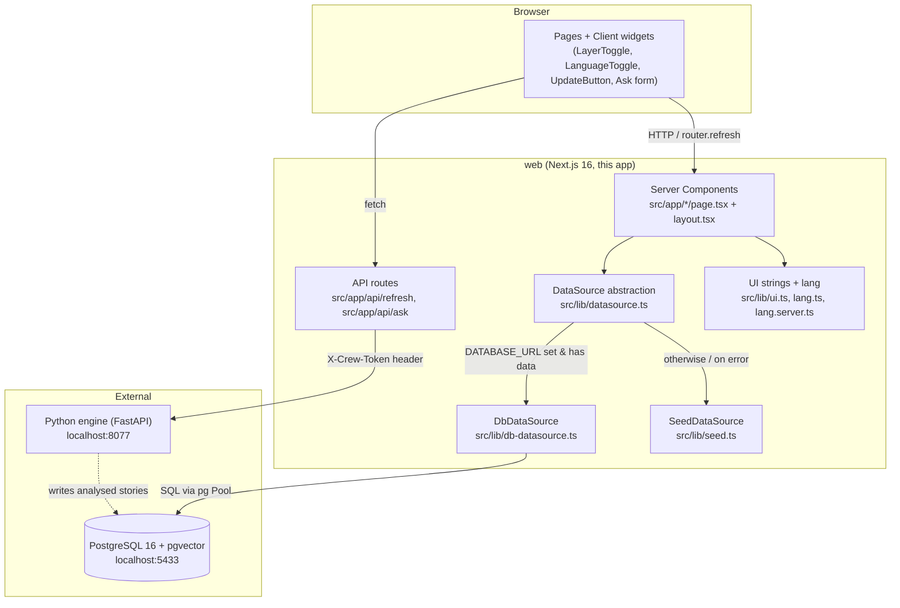
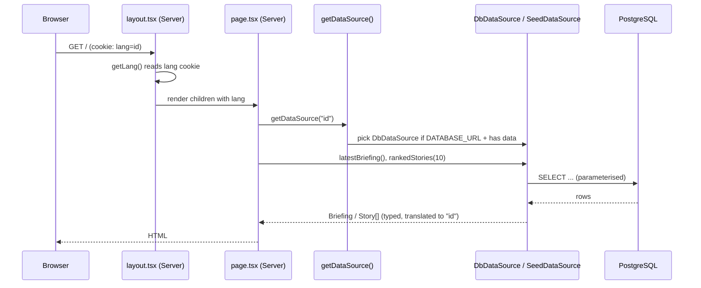

# Architecture Handbook — World & Finance 101 (web)

This is the developer handbook for the **`web`** app: the Next.js frontend of the
WorldNews-101 project. It is the part a reader actually sees in their browser. It
reads already-analysed news out of a PostgreSQL database (filled by a separate
Python engine) and renders it as a daily economic briefing for an Indonesian
audience, in three languages.

> New here? Read this page top to bottom, then dive into the four deep-dive files
> linked at the bottom.

---

## What this app is, in one paragraph

`web` is a **read-mostly Next.js 16 app** (App Router, React 19, Tailwind CSS 4).
Almost every page is a **Server Component** that, on each request, asks a
`DataSource` for stories and briefings and renders HTML. The `DataSource` is
either the live PostgreSQL database (`DbDataSource`) or a bundled demo dataset
(`SeedDataSource`) when no database is configured. The app does **not** generate
any AI content itself — that happens in the sibling Python `engine`. `web` only
*reads* the results, plus it has two thin API routes that *proxy* user actions
("update news", "ask a question") to that engine.

Jargon, defined once:
- **Server Component** — a React component that runs only on the server during a
  request. It can `await` data directly (no `useEffect`, no client fetch) and
  ships zero JavaScript to the browser for itself. This is the Next.js App Router
  default.
- **Client Component** — a component marked `"use client"` at the top. It runs in
  the browser and can use `useState`, `onClick`, etc. Used here only for the
  small interactive bits (toggles, buttons).
- **App Router** — the `src/app/` directory convention where each folder is a
  route and `page.tsx` is its page. (Older Next.js used `pages/`; this project
  does not.)

---

## High-level component diagram

Key takeaways from the diagram:
1. **Pages never touch SQL directly.** They go through `getDataSource()`, which
   hands back either the DB-backed or the seed-backed implementation of the same
   `DataSource` interface.
2. **The engine and the web app share only the database.** `web` reads; the
   engine writes. The only direct call from `web` to the engine is the two proxy
   API routes (refresh + ask), and those carry a secret token that never reaches
   the browser.
3. **The site never crashes when the DB is down.** If `DATABASE_URL` is unset, or
   the DB is empty/unreachable, the data layer silently falls back to
   `SeedDataSource` so the UI always renders.

---

## The data flow for a typical request

---

## Routes at a glance

All routes live under `src/app/`. Folder = URL segment; `page.tsx` = the page.

| URL | File | Type | What it shows |
|-----|------|------|----------------|
| `/` | `src/app/page.tsx` | Server | Today's briefing + ranked story feed |
| `/week` | `src/app/week/page.tsx` | Server | Last 7 days of stories grouped by day |
| `/archive` | `src/app/archive/page.tsx` | Server | List of past daily briefings |
| `/archive/[date]` | `src/app/archive/[date]/page.tsx` | Server | One past briefing + its stories |
| `/story/[id]` | `src/app/story/[id]/page.tsx` | Server | Full story: neutral read, "what this means for you", bias spread, sources |
| `/ask` | `src/app/ask/page.tsx` | Client | Free-text question form (currently demo answers) |
| `/sources` | `src/app/sources/page.tsx` | Server (static) | Outlet list + methodology |
| `/how-it-works` | `src/app/how-it-works/page.tsx` | Server (static) | Plain-English explainer |
| `POST/GET /api/refresh` | `src/app/api/refresh/route.ts` | Route handler | Proxy to engine `/run-daily` + `/run-status` |
| `POST /api/ask` | `src/app/api/ask/route.ts` | Route handler | Validates question; returns placeholder answer (engine not yet wired) |

---

## Deep-dive documents

- [`architecture/system-design.md`](architecture/system-design.md) — layers,
  rendering model, boundaries, external services, runtime/deployment, and the key
  design choices **and their trade-offs**.
- [`architecture/folder-structure.md`](architecture/folder-structure.md) — an
  annotated tree and the **"where do I add a new X"** map.
- [`architecture/classes-and-modules.md`](architecture/classes-and-modules.md) —
  a per-module reference: every page, component, lib module and the two API
  routes — responsibility, public surface, dependencies, and a "to change X,
  touch these files" note.
- [`architecture/tech-choices.md`](architecture/tech-choices.md) — each major
  library/framework: what it does here, why it was chosen, and a realistic
  alternative.

---

## Known rough edges (flagged, not fixed)

These are real inconsistencies found while reading the code. They are documented
so a new developer is not confused by them — **do not "fix" them as part of
reading this handbook**:

1. **Two visual styles coexist.** Most pages use the custom editorial design
   tokens (`bg-paper`, `text-ink`, `font-display`, `kicker` — defined in
   `src/app/globals.css`). But `src/app/ask/page.tsx`, `src/app/archive/[date]/page.tsx`,
   and `src/app/sources/page.tsx` still use generic Tailwind `slate-*`/`blue-*`
   colours and inline Georgia `fontFamily`. They predate the design-token system.
2. **`/ask` is a placeholder.** `src/app/api/ask/route.ts` has a `TODO` and
   returns canned demo text; it does not call the engine or the `questions`
   table. The `Question` type in `src/lib/types.ts` exists for the future wiring.
3. **Stack-version note.** `web/AGENTS.md` warns that this Next.js build "is NOT
   the Next.js you know" and that APIs may differ from training data — always
   check `node_modules/next/dist/docs/` before writing Next.js code here.
4. **`/ask` and `/archive/[date]` ignore the language cookie.** `ask/page.tsx`
   uses hardcoded English strings, and `archive/[date]/page.tsx` calls
   `getDataSource()` with no `lang` argument (defaults to English), so the story
   content there is not translated even when the reader picked ID/ZH.
