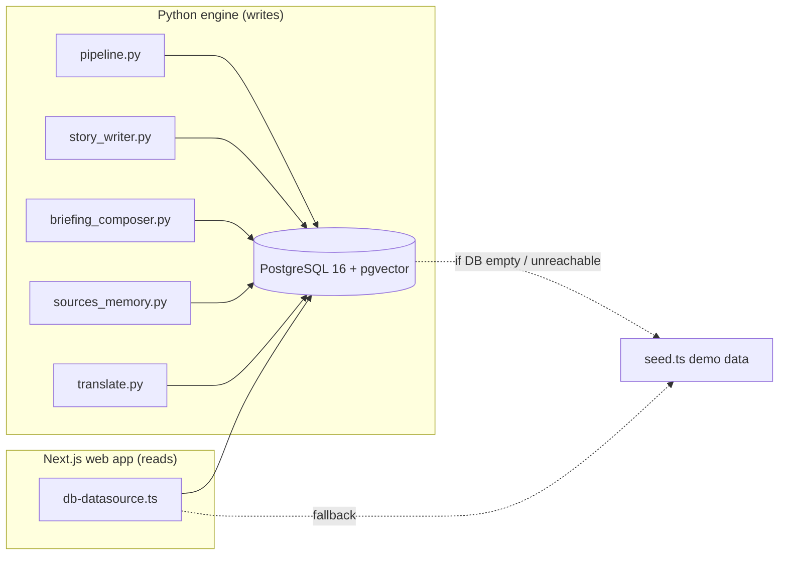

# 02 — Database (Overview)

This page is the entry point to everything about how WorldNews-101 stores data. If you are new, read this page first, then dive into the linked detail pages.

## What database is this?

- **Engine:** PostgreSQL 16, running from the Docker image `pgvector/pgvector:pg16`. (See `/home/jiwira/Projects/WorldNews-101/docker-compose.yml`.)
- **Extensions:** Two are enabled by the first migration:
  - `vector` (a.k.a. **pgvector**) — adds a `vector` column type so we can store the 768-number "embedding" of each article and later compare articles by meaning. An *embedding* is a list of numbers an AI model produces that captures the meaning of a piece of text; two texts with similar meaning produce vectors that are close together.
  - `pgcrypto` — gives us the `gen_random_uuid()` function, used to generate primary keys.
- **ORM:** None. There is **no ORM** (no Prisma, no Drizzle, no SQLAlchemy). All SQL is hand-written:
  - The **Python engine** writes data with raw `psycopg` (psycopg3) queries — see `/home/jiwira/Projects/WorldNews-101/engine/worldnews/db.py`, `story_writer.py`, `briefing_composer.py`, `sources_memory.py`, `translate.py`.
  - The **Next.js web app** reads data with the `pg` (node-postgres) driver — see `/home/jiwira/Projects/WorldNews-101/web/src/lib/db-datasource.ts`.
- **Schema location:** Plain `.sql` files in `/home/jiwira/Projects/WorldNews-101/db/migrations/`. There are three:
  - `0001_init.sql` — `stories`, `articles`, extensions, two indexes.
  - `0002_sources.sql` — adds `articles.author`; creates `sources` and `briefings`.
  - `0003_translations.sql` — adds the `translations` jsonb column to `stories` and `briefings`.

## How the database connects to the rest of the app

The web app **only reads**. Every row is written by the Python engine. If the database is unreachable or empty, the web app silently falls back to hard-coded demo data in `/home/jiwira/Projects/WorldNews-101/web/src/lib/seed.ts` (see [database/seeds.md](./database/seeds.md)).

## The tables at a glance

| Table | What it holds | Primary key | Defined in |
|-------|---------------|-------------|------------|
| `stories` | One row per *cluster* of related articles = one analyzed story. Holds the AI-written analysis (neutral / beginner / pro), sentiment, impact score, bias spread, affected regions, and per-language translations. | `id` (uuid) | `0001_init.sql` + `0003` |
| `articles` | One row per ingested news item (RSS / GDELT). Holds url, title, source, the 768-dim embedding, and a foreign key to the story it belongs to. | `id` (uuid) | `0001_init.sql` + `0002` |
| `briefings` | One row per **day**: the daily summary that ties together that day's top stories. Holds the headline, overall sentiment, summary markdown, an array of story ids, and translations. | `id` (uuid); `date` is unique | `0002_sources.sql` + `0003` |
| `sources` | Reputation memory: one row per news outlet name. Counts how many left/center/right articles we've seen from it, and a running divergence/reliability score. | `name` (text) | `0002_sources.sql` |

> **Important correction to the project survey:** an earlier survey map listed a fifth table, `questions`, for on-demand Q&A. **That table does not exist in the schema.** The `/ask` endpoint in `/home/jiwira/Projects/WorldNews-101/engine/worldnews/api.py` (line 141) only logs a `TODO: insert into questions table when schema is ready` and returns a generated id — nothing is persisted. Do not assume a `questions` table exists. The `Question` TypeScript interface in `web/src/lib/types.ts` is a frontend type, not a database table.

## Whole-schema diagram

```mermaid
erDiagram
    stories ||--o{ articles : "cluster_id (FK)"
    briefings }o--o{ stories : "story_ids[] (array, no FK)"
    articles }o--|| sources : "source name (logical, no FK)"

    stories {
        uuid id PK
        text topic
        timestamptz first_seen
        int source_count
        jsonb lean_spread
        text neutral_md
        text beginner_md
        text pro_md
        text sentiment
        int impact_score
        text impact_summary
        text_array affected_regions
        real region_relevance
        jsonb translations
        timestamptz created_at
    }
    articles {
        uuid id PK
        text url UK
        text title
        text source
        text country
        timestamptz published_at
        timestamptz fetched_at
        text summary
        vector embedding
        uuid cluster_id FK
        text lean
        real lean_confidence
        text author
    }
    briefings {
        uuid id PK
        date date UK
        uuid_array story_ids
        text headline
        text overall_sentiment
        text summary_md
        jsonb translations
        timestamptz created_at
    }
    sources {
        text name PK
        int article_count
        int lean_left
        int lean_center
        int lean_right
        real divergence_avg
        real reliability
        timestamptz updated_at
    }
```

> Mermaid note: the relationship between `briefings` and `stories` is via a `uuid[]` array column (`story_ids`), **not** a real SQL foreign key. The link between `articles.source` and `sources.name` is purely by matching the outlet name in application code — there is **no** declared foreign key. See [database/relations.md](./database/relations.md) for the full explanation and cascade behavior.

## Where to go next

- **[database/tables.md](./database/tables.md)** — every table, every column (type, meaning, nullability), every index and constraint.
- **[database/relations.md](./database/relations.md)** — how the tables connect, which links are real FKs vs. logical, and what happens on delete.
- **[database/seeds.md](./database/seeds.md)** — the demo-data fallback and how it differs from real DB content.
- **[database/migrations.md](./database/migrations.md)** — how migrations are applied, how to add one safely, and the gotchas (especially the missing vector index).

## Connection details (for local dev)

- Compose exposes Postgres at **`127.0.0.1:5433`** (host) → `5432` (container). It is bound to localhost only — never public.
- Credentials in `docker-compose.yml`: user `worldnews`, password `worldnews`, database `worldnews`.
- The Python engine reads the connection string from the **`DATABASE_URL`** environment variable (`/home/jiwira/Projects/WorldNews-101/engine/worldnews/db.py`, line 11).
- The web app reads `DATABASE_URL` too (`web/src/lib/datasource.ts`, line 29). If it is unset, the web app uses seed data and never touches Postgres.
