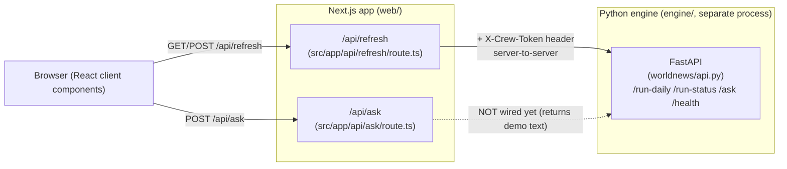

# 03 — API Layer

This page is the map of every way the WorldNews web app talks to "the outside" over HTTP.
If you are new here, read this page first, then jump into the detail pages it links to.

## The big picture: two API layers

There are **two** separate HTTP layers in this project, and it is important not to confuse
them:

1. **Next.js API routes** (this app, `web/`). These are the only endpoints the *browser*
   ever calls. They live under `src/app/api/**/route.ts`. There are exactly **two** of
   them today: `/api/ask` and `/api/refresh`.
2. **The Python engine API** (FastAPI, in the separate `engine/` project). This is the
   real analysis backend. The browser **never** calls it directly. Instead, the Next.js
   `/api/refresh` route acts as a *server-side proxy* to it, attaching a secret token the
   browser is not allowed to see.

> "API route" in Next.js 16 = a file named `route.ts` inside `src/app/...`. You export an
> async function named after the HTTP verb (`GET`, `POST`, …). Next.js calls that function
> when a request hits the matching URL path. There is no Express, no separate server file.

## What about reading stories, briefings, the archive, etc.?

Most of this app has **no read API at all**. Pages like the home page, `/week`,
`/archive`, `/story/[id]`, and `/sources` are **React Server Components** that read the
database *directly* on the server through the data-source layer
(`src/lib/datasource.ts` → `src/lib/db-datasource.ts`). There is no `/api/stories`
endpoint to call — the server component runs the SQL itself and renders HTML.

So when this handbook talks about "the API", it means only the two write/trigger routes
above plus the engine they proxy to. The read path is documented under the database and
data-flow handbook pages, not here.

## Quick reference

| Layer | Method + path | Purpose | Auth | File |
|-------|---------------|---------|------|------|
| Next.js | `POST /api/ask` | Submit a free-text question; currently returns **demo** text | None | `src/app/api/ask/route.ts` |
| Next.js | `POST /api/refresh` | Trigger a pipeline run (proxies to engine `/run-daily`) | None on the route; engine call carries `X-Crew-Token` | `src/app/api/refresh/route.ts` |
| Next.js | `GET /api/refresh` | Is a run in progress? (proxies to engine `/run-status`) | None | `src/app/api/refresh/route.ts` |
| Engine | `POST /run-daily` | Run ingest → cluster → analyze top N → compose briefing | `X-Crew-Token` header | `engine/worldnews/api.py` |
| Engine | `GET /run-status` | `{ running: bool }` | None | `engine/worldnews/api.py` |
| Engine | `POST /ask` | Queue a question (stub: does not persist yet) | `X-Crew-Token` header | `engine/worldnews/api.py` |
| Engine | `GET /health` | Liveness check | None | `engine/worldnews/api.py` |

## Detail pages

- [api/endpoints.md](api/endpoints.md) — every endpoint with exact input/output shapes,
  status codes, and copy-pasteable examples.
- [api/auth-and-middleware.md](api/auth-and-middleware.md) — how (the little) auth works,
  why there is no Next.js `middleware.ts`, public vs protected routes, and a step-by-step
  recipe for adding a new protected endpoint.

## Honest status notes (read these before trusting the code)

These are real gaps found by reading the code, flagged so you do not waste time:

- **`POST /api/ask` is a placeholder.** It validates the question, then returns hard-coded
  demo markdown. It never reaches the engine or the database. See the inline
  `// TODO(Plan 2/on-demand)` comment in `src/app/api/ask/route.ts`.
- **The engine's `POST /ask` is also a stub.** It logs the question and returns a random
  `question_id`, with a `# TODO: insert into questions table` comment. The `questions`
  table exists in the schema but nothing writes to it yet.
- **The security doc describes tech this app does not use.** `docs/05-SECURITY.md` mentions
  `zod` validation, a "tRPC layer", and "parameterized Drizzle queries". The actual web
  code uses **plain Next.js route handlers**, **manual `if`-based validation**, and the
  raw **`pg`** driver (no tRPC, no zod, no Drizzle — verified by grepping `src/` and
  `package.json`). Treat the security doc as *intended design*, not current reality, for
  these points.
- **No rate limiting exists in the app code.** The security doc calls for per-IP and
  global rate limits on the Ask endpoint; none are implemented in `route.ts`. Any such
  protection would currently only come from Cloudflare at the edge.
