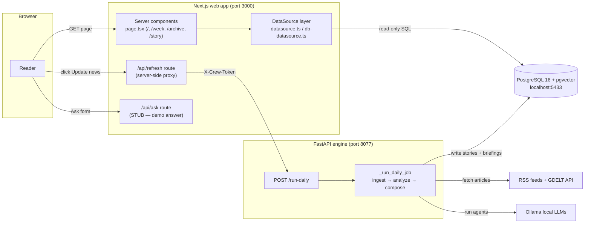

# 04 — Data Flow

This chapter explains **how data moves** through World & Finance 101: from a reader
clicking a link in the browser, through the Next.js server, into PostgreSQL, and
(for the heavy AI work) out to the separate Python "engine" service.

If you are new here, read this page first for the big picture, then drill into the
two detail pages linked at the bottom.

---

## The two halves of the system

There are **two completely separate running programs**. They do not share code or
memory — they only talk over HTTP and through a shared PostgreSQL database.

| Half | What it is | Where it lives | How it is reached |
|------|------------|----------------|-------------------|
| **Web app** (the "frontend") | A Next.js 16 server that renders pages and serves a few API routes | `/home/jiwira/Projects/WorldNews-101/web` | Browser → port 3000 |
| **Engine** (the "backend") | A FastAPI (Python) service that runs the CrewAI multi-agent AI pipeline | `/home/jiwira/Projects/WorldNews-101/engine` | Web app → port 8077 (server-to-server only) |

Both read and write the **same PostgreSQL database** (pgvector on `localhost:5433`).
That database is the real integration point between the two halves.

> **Jargon — Next.js Server Component:** Most pages here (`page.tsx` files) are
> *async server components*. They run **on the server**, can `await` a database
> query directly, and ship only finished HTML to the browser. There is no
> client-side data fetching for normal page loads. The few `"use client"` files
> (e.g. `UpdateButton.tsx`, `ask/page.tsx`, `LayerToggle.tsx`) run in the browser
> and use `fetch()`.

---

## The three data paths

There are exactly three ways data flows. Keep these straight and the whole system
makes sense.

### Path 1 — Reading pages (the common case)

Browser asks for a page → the Next.js server component calls the **DataSource**
layer → the DataSource runs **read-only SQL** against PostgreSQL → rows are mapped
to TypeScript objects → HTML is rendered and sent back. **The engine is not
involved at all.**

Key files:
- `web/src/lib/datasource.ts` — chooses the data source (`getDataSource`)
- `web/src/lib/db-datasource.ts` — the live PostgreSQL reader (`DbDataSource`)
- `web/src/lib/seed.ts` — the fallback used when the DB is empty/unreachable

### Path 2 — Triggering an update ("Update news" button)

A reader clicks **Update news** (top-right). The browser calls the Next.js API
route `web/src/app/api/refresh/route.ts`, which acts as a **server-side proxy**:
it adds the secret `X-Crew-Token` header and forwards to the engine's
`POST /run-daily`. The engine runs the whole ingestion + AI pipeline **in the
background** and writes new rows into PostgreSQL. The button then polls
`GET /api/refresh` (→ engine `GET /run-status`) every 20 s and calls
`router.refresh()` so freshly-written stories appear without a page reload.

The secret token **never reaches the browser** — that is the entire reason the
proxy route exists.

### Path 3 — The AI pipeline writing data (background)

Inside the engine, `POST /run-daily` kicks off `_run_daily_job` which:
1. **Ingests** RSS + GDELT articles (`pipeline.run_all`) and embeds + clusters them.
2. **Analyzes** the top clusters with the 5-agent crew (`write_story_for_cluster`),
   writing the `stories` rows.
3. **Composes** a daily briefing (`compose_briefing`), writing the `briefings` row.

This is the only path that **writes** story/briefing content. The web app never
writes to `stories`, `articles`, or `briefings` — it only reads them.

---

## One-glance diagram

---

## Important accuracy notes (verified against the code)

These correct common assumptions — confirm them before building on the "Ask"
feature:

1. **`/ask` is not wired to the engine.** `web/src/app/api/ask/route.ts` returns a
   hard-coded **demo answer** and never calls the engine or touches the database
   (see the `TODO(Plan 2/on-demand)` comment). The engine's `POST /ask`
   (`engine/worldnews/api.py`) is *also* a stub — it logs the question and returns
   `status: "pending"` but **does not insert into the `questions` table**
   (`# TODO: insert into questions table when schema is ready`). The `questions`
   table exists in the schema but is **not used by any live code path** today.

2. **The web app is read-only against the content tables.** Every method in
   `DbDataSource` is a `SELECT`. All writes to `stories`/`articles`/`briefings`
   happen in the Python engine.

3. **Reads never throw.** Each `DbDataSource` method wraps its query in
   `try/catch` and returns `null`/`[]` on failure, and `getDataSource` falls back
   to `SeedDataSource` if `DATABASE_URL` is missing or the DB is empty. A page will
   render with seed/empty content rather than crash.

---

## To change X, touch these files

| You want to… | Touch |
|---|---|
| Change what SQL a page reads | `web/src/lib/db-datasource.ts` (the matching method) and the page's `page.tsx` |
| Add a new read query for the frontend | Add a method to the `DataSource` interface in `web/src/lib/datasource.ts`, implement it in `db-datasource.ts` **and** `seed.ts` |
| Change the update-trigger behaviour | `web/src/app/api/refresh/route.ts` (proxy) and `web/src/components/UpdateButton.tsx` (button/polling) |
| Change what the background job does | `engine/worldnews/api.py` (`_run_daily_job`) and the pipeline/writer modules it calls |
| Actually implement "Ask" | `web/src/app/api/ask/route.ts`, `engine/worldnews/api.py` (`/ask`), plus a poller that fills the `questions` table |

---

## Detail pages

- **[data-flow/request-lifecycle.md](./data-flow/request-lifecycle.md)** — three
  representative user actions traced end-to-end with sequence diagrams and the real
  function names at each step.
- **[data-flow/diagrams.md](./data-flow/diagrams.md)** — system-level flowcharts of
  how data moves between client, server, database, the engine, external services
  and the background AI job.
