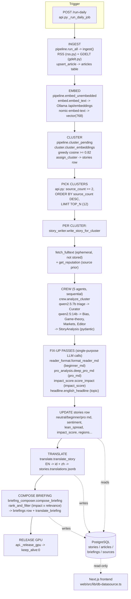

# 05 — AI Pipeline (overview)

This page is the map of how WorldNews-101 turns raw news articles into the
analysed, multi-language stories you see on the website. If you are new to the
codebase, read this page first, then dive into the four detail pages under
[`ai-pipeline/`](./ai-pipeline/).

## What the AI pipeline does, in one paragraph

Every "daily run" the engine **ingests** news (RSS feeds + the GDELT news API),
turns each article's title+summary into a numeric **embedding** (a 768-number
vector that captures meaning), **clusters** articles that talk about the same
event, then runs a **5-agent CrewAI "crew"** of local LLMs (large language
models, run on your own GPU via Ollama) over each cluster to produce a layered
analysis: a neutral summary, a beginner explainer, a pro/economist deep-dive, a
sentiment label, an economic impact score, a media-bias spread, and which
regions are affected. Three extra single-purpose LLM passes then **fix up** the
beginner text, the pro text, and the impact score (the crew is unreliable at
those). A final LLM pass writes a clean English **headline**, and another
**translates** everything into Indonesian and Chinese. Results are written to
PostgreSQL; the Next.js frontend only ever reads from the database.

> Jargon used above:
> - **Embedding**: a list of numbers representing text meaning, so we can measure
>   how "similar" two articles are with simple math (cosine similarity).
> - **LLM**: a text-generating AI model (here, `qwen2.5`).
> - **Ollama**: a local server (`http://localhost:11434`) that hosts the models
>   on your own machine — no cloud, no API key, no per-token cost.
> - **CrewAI**: a Python library for orchestrating several LLM "agents", each
>   with a role, that pass their output to the next agent.

## Where the code lives

| Stage | Main file |
|---|---|
| Orchestration / trigger | `engine/worldnews/api.py` (`_run_daily_job`) |
| Ingestion | `engine/worldnews/pipeline.py`, `engine/worldnews/ingest/rss.py`, `engine/worldnews/ingest/gdelt.py` |
| Embedding | `engine/worldnews/embed.py` |
| Clustering | `engine/worldnews/cluster.py` |
| Full-text fetch (ephemeral) | `engine/worldnews/fulltext.py` |
| Source bias memory | `engine/worldnews/sources_memory.py` |
| Crew (5 agents) | `engine/worldnews/crew/crew.py`, `agents.py`, `tasks.py`, `agents.yaml`, `tasks.yaml`, `schemas.py`, `config.py` |
| Per-story writer (glue) | `engine/worldnews/story_writer.py` |
| Fix-up: beginner layer | `engine/worldnews/reader_format.py` |
| Fix-up: pro layer | `engine/worldnews/pro_analysis.py` |
| Fix-up: impact score | `engine/worldnews/impact_score.py` |
| Headline | `engine/worldnews/headline.py` |
| Translation | `engine/worldnews/translate.py` |
| Ranking | `engine/worldnews/crew/relevance.py` |
| Daily briefing | `engine/worldnews/briefing_composer.py` |
| Tracing/observability | Phoenix, set up in `crew/crew.py` `_setup_tracing()` |

All paths are under `/home/jiwira/Projects/WorldNews-101/`.

## Full pipeline (input → inference → storage)

## The 5 crew agents at a glance

Defined in `engine/worldnews/crew/agents.yaml`, wired up in
`crew/agents.py`, run sequentially (`Process.sequential`) in `crew/crew.py`.

1. **Curator** (`curator`) — picks the most economically consequential angle;
   filters celebrity/sports noise. Uses the smaller/faster `triage_model`.
2. **Bias Analyst** (`bias_analyst`) — rates each source left/center/right and
   describes framing differences; reads the historical reputation prior.
3. **Game-Theory Analyst** (`game_theory_analyst`) — explains *why* actors act
   (incentives, leverage, second-order effects).
4. **Markets Analyst** (`markets_analyst`) — traces economic transmission:
   currencies, commodities, sectors, who pays.
5. **Editor** (`editor`) — synthesises everything into the final JSON
   (`StoryAnalysis`): sentiment, impact_score, region_relevance, summaries.

The Editor is the only task with `output_pydantic=StoryAnalysis`
(`crew/tasks.py`), forcing structured output validated by
`crew/schemas.py:StoryAnalysis`.

## Important: the crew output is *not* fully trusted

The local 14B model is unreliable at producing a strictly-structured block
*inside* a 9-field JSON, and at calibrating the 0–100 impact score. So
`story_writer.write_story_for_cluster` deliberately **overwrites** three crew
fields with dedicated single-purpose LLM calls:

- `beginner_md` ← `reader_format.format_reader_md`
- `pro_md` ← `pro_analysis.deep_pro_md`
- `impact_score` ← `impact_score.score_impact`

This "single-output call with a worked example is more reliable than
structure-inside-JSON" pattern is the single most important design idea in the
pipeline. See [`ai-pipeline/pipeline-overview.md`](./ai-pipeline/pipeline-overview.md).

## Detail pages

- [`ai-pipeline/pipeline-overview.md`](./ai-pipeline/pipeline-overview.md) —
  stage-by-stage walkthrough with real function names, queueing, and where
  results persist.
- [`ai-pipeline/models-and-parameters.md`](./ai-pipeline/models-and-parameters.md) —
  every model and every tunable parameter, with file:line, current value, and
  the effect of changing it.
- [`ai-pipeline/prompts-and-context.md`](./ai-pipeline/prompts-and-context.md) —
  all prompts/templates and how context (article text, reputation priors,
  prior-task outputs) is assembled.
- [`ai-pipeline/failure-modes.md`](./ai-pipeline/failure-modes.md) — how it
  fails, what is already handled, and what to watch for.

## A note on the `/ask` (on-demand Q&A) feature

The database has a `questions` table and the frontend has an `/ask` page, but the
backend endpoint `api.py:ask()` is currently a **stub**: it logs the question and
returns `status: "pending"` with a `# TODO: insert into questions table when
schema is ready` comment. No LLM is invoked for `/ask` today. Treat on-demand
Q&A as not-yet-implemented on the engine side.
