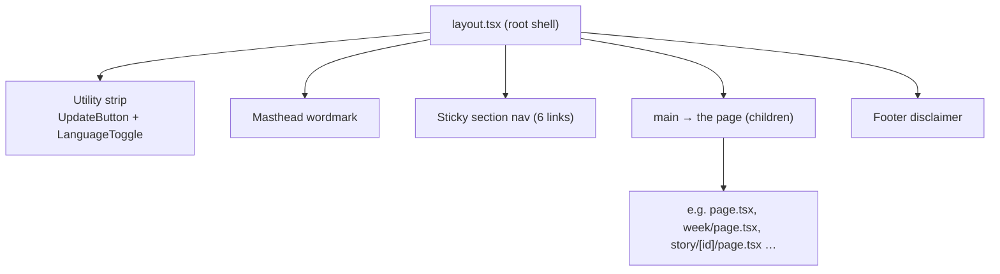

# 06 — UI / UX

This page is the map of the **frontend** of WorldNews-101 (the `web/` app): what the
screens look like, what reusable pieces they are built from, and how a reader moves
through the site. If you are new and need to change anything visual, start here.

## What kind of app is this?

This is a **WEB app**, not mobile. The evidence (verified by reading the files):

- `web/package.json` depends on `next`, `react`, `react-dom`, `react-markdown` — and there
  is no `pubspec.yaml` or `lib/*.dart`. So the "mobile" adaptation in the brief does not
  apply; everything below is the real Next.js / React UI.
- The framework is **Next.js 16 with the App Router** (`src/app/**`). Pages are mostly
  **React Server Components** (RSC) — they run on the server, read the database directly,
  and send finished HTML. Only a few small pieces are **Client Components** (marked with
  `"use client"`) for interactivity.

> Jargon: a **Server Component** runs only on the server and can `await` data (no `useState`,
> no `onClick`). A **Client Component** ships JavaScript to the browser and can use hooks and
> event handlers. In this codebase the rule of thumb is: pages are server components; anything
> that needs a button click, toggle, or polling is a small client component.

## The shape of every page

Every screen is wrapped by one shared shell, `src/app/layout.tsx` (the App Router "root
layout"). It renders, top to bottom:

1. A thin dark **utility strip** with a tagline, the `UpdateButton`, and the
   `LanguageToggle`.
2. A centered **masthead** wordmark: "World **&** Finance **101**".
3. A **sticky section nav** (`Today / This Week / Archive / Ask / Sources / How it works`).
4. The page content inside `<main>` (constrained to `max-w-3xl`).
5. A **footer** with the AI / not-financial-advice disclaimer.

So when you build a new page under `src/app/`, you only write the *content*; the chrome is
already there.

## The routes (one folder = one URL)

| URL | File | Type | What it shows |
|-----|------|------|---------------|
| `/` | `src/app/page.tsx` | Server | Today's briefing + ranked story feed |
| `/week` | `src/app/week/page.tsx` | Server | Last 7 days of stories, grouped by day |
| `/archive` | `src/app/archive/page.tsx` | Server | List of past daily briefings |
| `/archive/[date]` | `src/app/archive/[date]/page.tsx` | Server | One past briefing + its stories |
| `/story/[id]` | `src/app/story/[id]/page.tsx` | Server | One story: outlook, impact, neutral read, "what this means for you", bias, sources |
| `/ask` | `src/app/ask/page.tsx` | **Client** | Free-text question box (currently demo answers) |
| `/sources` | `src/app/sources/page.tsx` | Server (static) | Methodology + outlet directory |
| `/how-it-works` | `src/app/how-it-works/page.tsx` | Server (static) | Short explainer of the 5 agents |

The server pages that read live data declare `export const dynamic = "force-dynamic"` so
Next.js re-reads the database on every request instead of freezing the page at build time.

## Detail pages

- [ui-ux/design-decisions.md](ui-ux/design-decisions.md) — the styling system (Tailwind v4
  `@theme` tokens, the editorial serif/sans split), layout/responsive strategy,
  accessibility, internationalization (EN/ID/ZH), and the trade-offs behind the notable
  choices. **Read this before changing colors, fonts, or spacing.**
- [ui-ux/component-inventory.md](ui-ux/component-inventory.md) — every reusable component in
  `src/components/`: its props contract, what it renders, and where it is used.
- [ui-ux/user-journeys.md](ui-ux/user-journeys.md) — the main reader journeys, screen by
  screen, tying each screen to its route and components.

## Honest status notes (found by reading the code)

These are real issues, flagged so you do not assume the UI is uniform:

- **Two visual styles coexist.** The home, week, archive-list, and story pages use the
  intended **editorial design tokens** (`bg-paper`, `text-ink`, `font-display`, `kicker`,
  etc. — see design-decisions). But `src/app/ask/page.tsx`,
  `src/app/archive/[date]/page.tsx`, `src/app/sources/page.tsx`, and
  `src/app/how-it-works/page.tsx` still use the **old default Tailwind palette**
  (`text-slate-900`, `bg-blue-600`, `border-amber-200`) and inline
  `style={{ fontFamily: "Georgia, …" }}`. They look like a different site. If you touch
  these pages, migrating them to the tokens is the right move.
- **`/ask` is not wired to the engine.** The form posts to `POST /api/ask`, which returns
  hard-coded demo markdown (see `src/app/api/ask/route.ts`, `TODO(Plan 2/on-demand)`). The
  UI also only renders `answer.beginnerMd` — it never shows the `proMd` it receives, and it
  is **not** internationalized (English-only strings, unlike the rest of the app).
- **No `loading.tsx` / `error.tsx` / `not-found.tsx`.** Server pages call `notFound()` where
  appropriate, but there are no custom loading skeletons or error boundaries; Next.js
  defaults apply.
