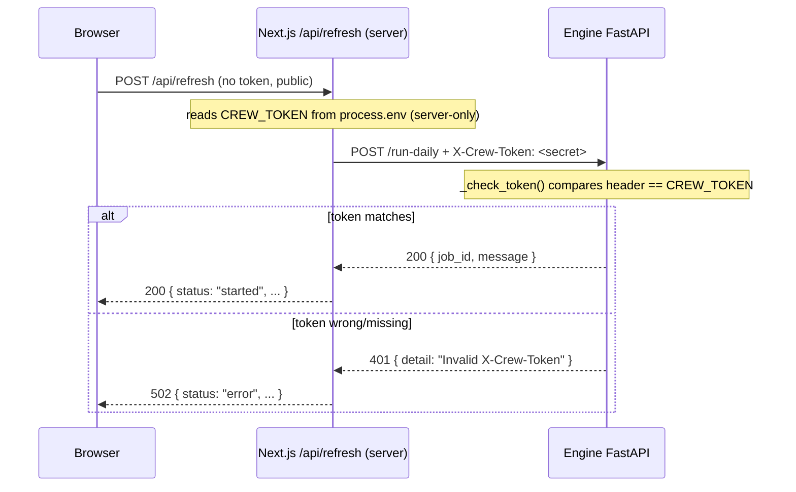

# API — Auth & middleware

How requests are (and are not) authenticated, what middleware exists, which routes are
public vs protected, and a recipe for adding a new protected endpoint.

## The one-paragraph summary

The **public website has no user login and no per-user auth** — it is a read-mostly news
site, so the browser-facing Next.js routes (`/api/ask`, `/api/refresh`) are **open**. The
only secret in the system is a single shared **`X-Crew-Token`** that protects the *engine*
(the GPU-bound Python pipeline) from being triggered by strangers. That token lives only on
the server. The browser never sees it; the Next.js `/api/refresh` route attaches it when it
proxies to the engine.

## There is no Next.js `middleware.ts`

Verified: there is **no `src/middleware.ts`** (or `middleware.js`) in this app. So there is
no global request interceptor, no auth gate, no rewrite/redirect chain. Each `route.ts`
handler is fully responsible for its own validation. If you expect a Next.js middleware
chain from other projects, there isn't one here — do not look for it.

> Next.js middleware would be a single `src/middleware.ts` exporting a `middleware()`
> function that runs before matching routes. Adding one is the standard way to enforce
> auth across many routes at once — see "Adding auth across many routes" below.

## The two auth realms



### Realm 1 — Public (browser-facing Next.js routes)

| Route | Protected? | How it limits abuse |
|-------|-----------|---------------------|
| `POST /api/ask` | No | Input validation only: non-empty, ≤ 500 chars (`src/app/api/ask/route.ts`) |
| `POST /api/refresh` | No | None in app code; relies on the engine's single-run lock + (intended) Cloudflare edge limits |
| `GET /api/refresh` | No | Read-only status; nothing sensitive |

These have no token and no session. The *defense-in-depth* story (per
`docs/05-SECURITY.md`) is that the whole site sits behind a Cloudflare Tunnel that provides
TLS, WAF, DDoS protection, and rate limiting at the edge — but **none of that lives in this
repo's code**. The doc also calls for per-IP/global rate limiting and zod validation on the
Ask endpoint; **neither is implemented** in the current handlers (manual `if` checks only).

### Realm 2 — Protected (engine FastAPI routes)

The engine guards write/trigger endpoints with a shared bearer-style token sent in the
`X-Crew-Token` **request header**.

The check, from `engine/worldnews/api.py`:

```python
CREW_TOKEN = os.environ.get("CREW_TOKEN", "changeme-in-production")

def _check_token(x_crew_token: str = Header(...)) -> None:
    if x_crew_token != CREW_TOKEN:
        raise HTTPException(status_code=401, detail="Invalid X-Crew-Token")
```

It is attached to endpoints declaratively via FastAPI dependencies:

```python
@app.post("/run-daily", response_model=JobResponse, dependencies=[Depends(_check_token)])
@app.post("/ask",       response_model=AskResponse, dependencies=[Depends(_check_token)])
```

Key facts:
- `Header(...)` makes the header **required**; a missing header is a `422`/`401`-class
  rejection by FastAPI, a wrong value is the explicit `401 Invalid X-Crew-Token`.
- It is a **single shared secret**, not per-user. Comparison is a plain `!=` (not constant
  time) — acceptable here because the engine is not internet-exposed.
- `/run-status` and `/health` are intentionally **unprotected** (status/liveness only).

### How the token reaches the engine without touching the browser

In `src/app/api/refresh/route.ts`:

```ts
const ENGINE = process.env.ENGINE_URL ?? "http://localhost:8077";
const TOKEN  = process.env.CREW_TOKEN ?? "";
// ...
const res = await fetch(`${ENGINE}/run-daily`, {
  method: "POST",
  headers: { "X-Crew-Token": TOKEN },
  signal: AbortSignal.timeout(8000),
});
```

Because `route.ts` runs only on the server, `process.env.CREW_TOKEN` is read server-side
and the header is added in a server-to-server `fetch`. The token value is never serialized
into any response sent to the browser. (Contrast: an env var prefixed `NEXT_PUBLIC_` *would*
be exposed to the client — `CREW_TOKEN` is deliberately not prefixed.)

Config lives in `web/.env.local` (template: `web/.env.example`):

```
ENGINE_URL=http://localhost:8077
CREW_TOKEN=changeme-match-engine-.env   # MUST equal the engine process's CREW_TOKEN
```

The web app's `CREW_TOKEN` must be **identical** to the engine process's `CREW_TOKEN`, or
every `/run-daily` proxy call will come back `401` (surfaced to the browser as the `502`
`{ status: "error" }` body).

## Recipe — add a new endpoint

### A new public Next.js route (e.g. `GET /api/sources-stats`)

1. Create `src/app/api/sources-stats/route.ts`.
2. Export the verb function and validate inputs yourself (there is no shared validator):

   ```ts
   import { NextResponse } from "next/server";
   export async function GET() {
     // ...read data / proxy as needed...
     return NextResponse.json({ ok: true });
   }
   ```
3. If it must not be cached, add `export const dynamic = "force-dynamic";` (as
   `refresh/route.ts` does).

### A new *protected* route (one that triggers/owns the engine)

The token guard lives on the **engine** side, not the Next.js side. So "protected" here
means: the Next.js route is a thin server-side proxy that attaches `X-Crew-Token`, and the
engine endpoint enforces it.

1. **Engine:** in `engine/worldnews/api.py`, add the endpoint and require the token:

   ```python
   @app.post("/my-action", dependencies=[Depends(_check_token)])
   async def my_action(req: MyRequest) -> MyResponse:
       ...
   ```
2. **Next.js proxy:** add `src/app/api/my-action/route.ts` modeled on
   `src/app/api/refresh/route.ts` — read `ENGINE_URL` + `CREW_TOKEN` from `process.env`,
   `fetch` the engine with the `X-Crew-Token` header, map engine statuses (e.g. `409`,
   non-OK, network error) to your own response shape, and set a timeout via
   `AbortSignal.timeout(...)`. **Never** put the token in the response body or in any
   `NEXT_PUBLIC_*` variable.
3. **Client:** call your `/api/my-action` route from the component, never the engine
   directly (the engine is not reachable from the browser).

### Adding auth across many routes (if the site ever needs login)

There is no auth framework wired in today. If you need to protect a *group* of browser
routes, the idiomatic Next.js approach is to create `src/middleware.ts` exporting a
`middleware(req)` function plus a `config.matcher`, and check a session cookie/header there
— this would be a new architectural decision and should be recorded in `docs/06-DECISIONS.md`
and reflected in `docs/05-SECURITY.md`.

## Gaps to be aware of (flagged from the code)

- **No rate limiting in app code.** `docs/05-SECURITY.md` §4/§8 specify per-IP and global
  rate limits on the Ask endpoint; the handlers implement none. Any limiting today would
  be Cloudflare-edge only, which is infra, not in this repo.
- **No zod / schema validation.** The security doc references zod and a tRPC layer. Neither
  exists in `web/` (verified: no `zod`/`trpc` in `src/` or `package.json`). Validation is
  hand-rolled `if` checks in each handler.
- **Default token is weak.** Both sides default `CREW_TOKEN` to a placeholder
  (`"changeme-in-production"` on the engine, `""` on the web side). In any real deployment
  both must be set to a strong shared value; otherwise `/run-daily` is effectively
  unprotected (or always failing, if only one side sets it).
