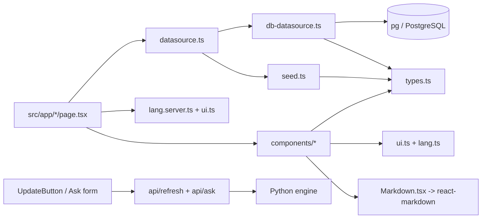

# Classes & Modules Reference

A per-module walkthrough of the `web` app. For each item: **responsibility**,
**public surface** (what it exports / who calls it / what it calls), **dependencies**,
and a **"to change X, touch these files"** note.

This frontend has no classes in the OOP-heavy sense except the two `DataSource`
implementations; everything else is React components and plain functions/modules.
All paths are under `/home/jiwira/Projects/WorldNews-101/web`.

---

## A. Domain types — `src/lib/types.ts`

**Responsibility.** The single source of truth for every data shape used across the
frontend. No logic, just TypeScript interfaces and union types.

**Public surface (exports).**
- `Sentiment = "bullish" | "neutral" | "bearish"`
- `Lean = "left" | "center" | "right"`
- `LeanSpread { left: number; center: number; right: number }`
- `SourceRef { source: string; url: string; lean: Lean }`
- `Story` — the big one: `id, topic, sourceCount, leanSpread, sources[],
  neutralMd, beginnerMd, proMd, sentiment, impactScore (0–100), impactSummary,
  affectedRegions[], regionRelevance (0–1), date?`.
- `Briefing` — `id, date (ISO yyyy-mm-dd), headline, overallSentiment,
  beginnerMd, proMd, storyIds[]`.
- `QuestionStatus` and `Question` — for the (not-yet-wired) `/ask` feature.

**Callers.** Almost everything: the data layer, every page, every component.

**Dependencies.** None.

**To change a data shape:** edit here first, then update mapping in
`db-datasource.ts`, demo objects in `seed.ts`, and any component that renders the
field. (See folder-structure.md "Add a new field to a story".)

---

## B. Data-access abstraction — `src/lib/datasource.ts`

**Responsibility.** Define the contract pages use to read data, and decide *which*
implementation backs it (live DB vs bundled seed).

**Public surface.**
- `interface DataSource` with methods: `latestBriefing()`, `briefingByDate(date)`,
  `recentBriefings(limit)`, `storyById(id)`, `storiesByIds(ids)`,
  `rankedStories(limit)` (ordered by `impactScore × regionRelevance`),
  `storiesInRange(days)` (powers `/week`).
- `getDataSource(lang = "en"): Promise<DataSource>` — the factory.

**How the factory decides (verified logic).**
1. If `process.env.DATABASE_URL` is unset, return the shared `SeedDataSource`.
2. Otherwise dynamically `import("./db-datasource")` and, **once per process**,
   probe whether the DB actually has display-ready data (`recentBriefings(1)` or
   `rankedStories(1)`). The boolean result is cached in module-level `_useDb`.
3. Return a new `DbDataSource(dbUrl, lang)` if data exists, else the seed.
4. Any error → cache `_useDb = false` and return the seed. **Never throws.**

**Callers.** Every server page: `page.tsx`, `week/page.tsx`, `archive/page.tsx`,
`archive/[date]/page.tsx`, `story/[id]/page.tsx`.

**Callees.** `SeedDataSource` (eagerly), `DbDataSource` (lazily imported).

**To change which/when a backend is used, or add a query method:** edit this file
(interface + factory) and implement the method in both `db-datasource.ts` and
`seed.ts`.

---

## C. `DbDataSource` (class) — `src/lib/db-datasource.ts`

**Responsibility.** The *only* place that runs SQL. Reads PostgreSQL via the `pg`
pool, converts raw rows into the domain types, and applies per-language
translations. Read-only — it never writes.

**Public surface.** `class DbDataSource implements DataSource`,
`constructor(connectionString, lang = "en")`, plus all `DataSource` methods.

**Important internals (read these before editing):**
- **Connection pool**: module-level singleton `_pool` (`getPool()`), `max: 5`,
  `idleTimeoutMillis: 30000`. All instances share it — do not create per-request
  pools.
- **Row mappers**: `rowToStory(row, sources, lang)` and
  `rowToBriefing(row, storyIds, lang)`. These tolerate column-name variants
  (e.g. `neutral_md` *or* `analysis_neutral`) and missing values via defaults.
- **Coercers**: `toSentiment`, `toLean`, `toLeanSpread` (parses the `lean_spread`
  jsonb, tolerating a raw string), `toDateString` (timezone-safe — see below),
  `toStringArray`.
- **Translations**: `tr(row, lang)` pulls `row.translations[lang]` (a jsonb
  object) and returns `{}` for English or when absent. Mappers prefer the
  translated field, falling back to the English column. **Missing translations
  fall back silently** — there is no error if a language is absent.
- **Timezone care**: `toDateString` reads local `getFullYear/Month/Date` instead
  of `toISOString()` because node-pg parses a Postgres `DATE` at *local* midnight;
  `toISOString()` would shift the day in non-UTC zones. `rankedStories()` builds
  local day bounds (`dayStart`/`dayEnd`) for the same reason.
- **Error handling**: every method is wrapped in try/catch returning `null` or
  `[]`. The site degrades gracefully.

**Notable queries:**
- `rankedStories(limit)` — today's analysed stories
  (`neutral_md IS NOT NULL`, `created_at` within the local day), ordered by
  `impact_score * COALESCE(region_relevance, 0) DESC`. It deliberately does **not**
  drop low-global-impact stories, because a story can be locally important.
- `storiesInRange(days)` — each story's `story_date` = `max(articles.published_at)`
  for that cluster; lists stories in the window newest-day-first. Sources are
  omitted here on purpose to avoid an N+1 query (the list view only needs counts +
  the lean spread).
- `sourcesForStory(id)` (private) — fetches per-article `source, url, lean` for a
  story's `cluster_id`.

**Dependencies.** `pg` (`Pool`), `./datasource` (interface), `./types`.

**To change a query / mapping / pool config:** this file only. To add a *new*
method, also add it to the interface and to `seed.ts`.

---

## D. `SeedDataSource` (class) — `src/lib/seed.ts`

**Responsibility.** Provide realistic demo content (seven Indonesia-focused
economic stories + one daily briefing, English only) so the site renders with no
DB. It implements the same `DataSource` interface, so pages can't tell the
difference.

**Public surface.** `class SeedDataSource implements DataSource` with all the
interface methods backed by the in-file `STORIES` array and `BRIEFING` object.

**Notable behaviour.** `rankedStories` sorts the demo stories by
`impactScore × regionRelevance`. `storiesInRange` spreads the demo stories across
recent days (2 per day) so `/week` has something to group.

**Dependencies.** `./datasource`, `./types`. No DB, no network.

**To change demo content:** edit the `STORIES`/`BRIEFING` literals here. Keep them
in sync with the `Story`/`Briefing` types (TypeScript enforces this).

---

## E. i18n modules

### `src/lib/lang.ts` (client-safe)
**Responsibility.** Language primitives usable in both client and server code (no
server-only imports). **Exports:** `Lang` type, `LANGS` (code+label list),
`normalizeLang(v)` (anything not `"id"`/`"zh"` → `"en"`).
**Callers:** `LanguageToggle` (client), `lang.server.ts`, components that accept a
`lang` prop.

### `src/lib/lang.server.ts` (server-only)
**Responsibility.** `getLang(): Promise<Lang>` — reads the `lang` cookie via Next's
`cookies()` and normalises it. **Callers:** `layout.tsx` and every server page.
**Dependency:** `next/headers`, `./lang`.

### `src/lib/ui.ts`
**Responsibility.** The dictionary of **static UI-chrome** strings (nav, captions,
buttons, sentiment/impact labels, disclaimers) in EN/ID/ZH. Content (stories) is
translated elsewhere (DB). **Exports:** `UIKey` type and `t(lang, key)` (falls back
to English if a key/lang is missing). The `S` object `satisfies Record<string, Str>`,
so the compiler forces all three languages for every key.
**Callers:** `layout.tsx` and most components/pages.
**To add/change a label:** edit `S` here.

---

## F. Pages (`src/app/`)

### `layout.tsx` — Root layout
**Responsibility.** The page shell every route renders inside: `<html lang>`,
top utility strip (tagline + `UpdateButton` + `LanguageToggle`), masthead
wordmark, sticky section `nav` (driven by the `NAV` array), `<main>`, and footer
disclaimer. Reads the language with `getLang()` and labels via `t()`.
**Exports:** `metadata` and the default `RootLayout`.
**Calls:** `getLang`, `t`, `LanguageToggle`, `UpdateButton`.
**To change global chrome / nav items:** here (plus add label keys in `ui.ts`).

### `page.tsx` — `/` (Home)
**Responsibility.** Today's briefing (headline + `LayerToggle`) and the ranked
story feed (`StoryCard` list). `dynamic = "force-dynamic"`. Has a local
`formatDate` + `MONTHS` helper.
**Calls:** `getDataSource(lang).latestBriefing()` + `.rankedStories(10)`,
`SentimentBadge`, `LayerToggle`, `StoryCard`.

### `week/page.tsx` — `/week`
**Responsibility.** Calls `storiesInRange(7)`, groups stories by their `date` into a
`Map`, sorts days newest-first, renders each day as a section of `StoryCard`s.
Local `dayHeading` helper (weekday + day + month). `force-dynamic`.

### `archive/page.tsx` — `/archive`
**Responsibility.** `recentBriefings(30)` rendered as a linked list to
`/archive/[date]`, each with a `SentimentBadge`. `force-dynamic`. Local
`formatDate`.

### `archive/[date]/page.tsx` — `/archive/[date]`
**Responsibility.** One briefing by date (`briefingByDate`) + its stories
(`storiesByIds(briefing.storyIds)`); `notFound()` if absent. **Flagged:** uses
generic `slate`/`blue` styling and inline Georgia font (pre-design-token), and
calls `getDataSource()` with no `lang` (content not translated here).

### `story/[id]/page.tsx` — `/story/[id]`
**Responsibility.** The full story view: header (topic, impact summary), an
"at a glance" panel (`SentimentBadge` + `ImpactMeter`), affected-region chips, the
neutral read (`Markdown`), "what this means for you" (`LayerToggle`),
`BiasSpread`, and a sources grid (external links with per-source lean labels via
local `LEAN_META`). `notFound()` if the story is missing. Params are awaited
(`params: Promise<{id}>`).

### `ask/page.tsx` — `/ask`
**Responsibility.** A `"use client"` form that POSTs `{question}` to `/api/ask`
and renders the returned `beginnerMd` via `Markdown`. **Flagged:** uses English-only
hardcoded strings and generic `slate`/`blue` styling; answers are currently demo
placeholders.

### `sources/page.tsx` — `/sources`
**Responsibility.** Static editorial page: hand-maintained `INDONESIAN_OUTLETS`,
`INTERNATIONAL_OUTLETS`, `SUPPLEMENTARY` arrays + a 5-step "how aggregation works"
explainer + caveats. Local `OutletRow` component. **Flagged:** generic styling,
not internationalised.

### `how-it-works/page.tsx` — `/how-it-works`
**Responsibility.** Short static explainer of the five-agent pipeline. Uses
`.prose-wn` but otherwise generic styling; English-only.

---

## G. API route handlers (`src/app/api/`)

### `api/refresh/route.ts`
**Responsibility.** Server-side proxy to the engine for the "Update news" button.
- `POST` → `fetch(${ENGINE}/run-daily, { headers: { "X-Crew-Token": TOKEN }, signal: AbortSignal.timeout(8000) })`.
  Maps engine `409` → `{status:"running"}`, non-OK → `{status:"error"}` (502),
  success → `{status:"started", ...}`, network error → `{status:"offline"}` (503).
- `GET` → `fetch(${ENGINE}/run-status)`; on failure `{running:false, offline:true}`.
- `dynamic = "force-dynamic"`. Reads `ENGINE_URL` (default `http://localhost:8077`)
  and `CREW_TOKEN` from env. **The token never leaves the server.**
**Callers:** `UpdateButton` (client) via `/api/refresh`.

### `api/ask/route.ts`
**Responsibility.** `POST` handler that validates a question (non-empty, ≤500
chars; 400 otherwise) and **returns placeholder demo content**. Has a
`TODO(Plan 2/on-demand)` to insert into the `questions` table and run the crew.
**Callers:** `ask/page.tsx`.
**To wire it up for real:** implement the TODO here, likely calling the engine's
`/ask` endpoint and/or inserting into `questions`; populate `Question` from
`types.ts`.

---

## H. Components (`src/components/`)

### `StoryCard.tsx` (server)
**Responsibility.** One row in any story feed: rank number, topic (links to
`/story/[id]`), `SentimentBadge`, clamped impact summary, compact `BiasSpread`,
`ImpactTag`, source count, up-to-3 region chips.
**Props:** `{ story: Story; rank?: number; lang?: Lang }`.
**Calls:** `SentimentBadge`, `BiasSpread`, `ImpactTag`, `t`, `next/link`.
**Used by:** home, `/week`, `/archive/[date]`.

### `BiasSpread.tsx` (server)
**Responsibility.** Renders the left/centre/right coloured proportion bar
(`bg-lean-left/center/right`) + a legend; `compact` mode for cards, full mode (with
disclaimer) for the story page. Divides by `max(total, 1)` to avoid div-by-zero.
**Props:** `{ spread: LeanSpread; sourceCount: number; compact?; lang? }`.
Internal `Legend` helper.

### `SentimentBadge.tsx` (server)
**Responsibility.** Plain-language economic *outlook* badge (Positive/Mixed/
Negative) with arrow + colour; the finance term (bullish/bearish/neutral) is kept
only in the tooltip. Optional `showGloss`.
**Props:** `{ sentiment: Sentiment; showGloss?; lang? }`. Internal `MAP`.

### `Impact.tsx` (server)
**Responsibility.** Two exports sharing one `tier(score)` thresholding (≥70 high /
≥40 moderate / else low): `ImpactTag` (inline dot + "Impact NN" for cards) and
`ImpactMeter` (big number + labelled bar for the story page).
**Props:** both take `{ score: number; lang? }`.

### `Markdown.tsx` (server)
**Responsibility.** The safe way to render model-generated markdown. Wraps
`react-markdown` (raw HTML disabled by default, so model output can't inject
`<script>`) in a `.prose-wn` container.
**Props:** `{ children: string }`. **Always render AI/markdown text through this.**

### `LayerToggle.tsx` (CLIENT)
**Responsibility.** The beginner↔pro reading-level toggle. Shows `beginnerMd` by
default; reveals the toggle button only when `proMd` is non-empty and differs from
`beginnerMd` (`hasLayers`). Local `useState`.
**Props:** `{ beginnerMd; proMd; lang? }`. **Calls:** `Markdown`, `t`.

### `LanguageToggle.tsx` (CLIENT)
**Responsibility.** EN/ID/中文 switch. On click: writes a 1-year `lang` cookie
(`path=/; samesite=lax`) and calls `router.refresh()` to re-render server
components in the new language.
**Props:** `{ current: Lang }`. **Calls:** `LANGS`, `useRouter`.

### `UpdateButton.tsx` (CLIENT)
**Responsibility.** Triggers and tracks a pipeline run. On mount, GETs
`/api/refresh` to reflect a run already in progress. On click, POSTs to start a
run, shows a status note (`update_started` / `update_inprogress` / `update_offline`
from `ui.ts`), then enters a polling loop (every 20s) that `router.refresh()`es the
page until the run reports done. State machine: `idle | running | note`.
**Props:** `{ lang: Lang }`. **Calls:** `/api/refresh`, `useRouter`, `t`.

---

## I. Styling module — `src/app/globals.css`

**Responsibility.** Not a TS module but central: imports Tailwind v4, declares the
design tokens under `@theme` (`--color-paper/surface/ink/brand/gold`, sentiment
`bull/bear/flat`, lean `left/center/right`) which Tailwind turns into utilities
(`bg-paper`, `text-brand`, …), sets the serif heading family, and defines the
`.kicker`, `.font-display`, and `.prose-wn` (markdown) styles.
**To re-theme the site:** edit the `@theme` block here.

---

## Cross-cutting dependency summary

