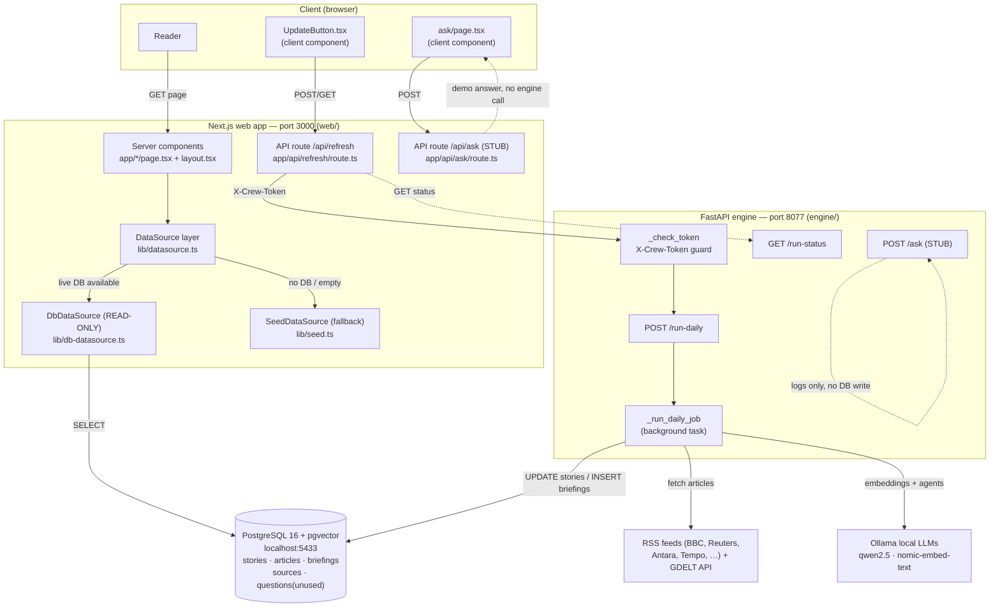
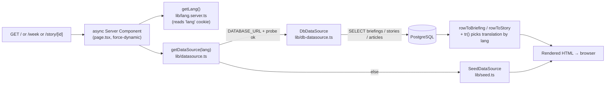
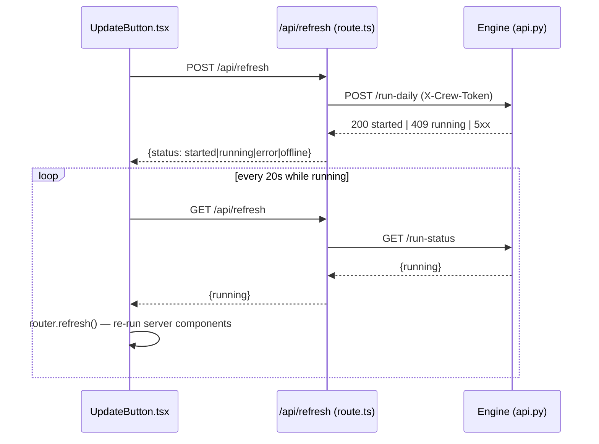

# System-level Data-Flow Diagrams

These flowcharts show **where data lives and how it moves** between the browser, the
Next.js server, PostgreSQL, the FastAPI engine, external services, and the
background AI job. Every box and arrow below corresponds to real code — file paths
are given so you can jump straight to the source.

For narrated, step-by-step versions of these, see
[request-lifecycle.md](./request-lifecycle.md). For the prose overview, see
[../04-data-flow.md](../04-data-flow.md).

---

## 1. Whole-system map

The single most important thing: **the web app reads, the engine writes, and
PostgreSQL is the only thing they share.** Authentication exists only on the
engine boundary (the `X-Crew-Token` header), not for ordinary readers.



**Dashed arrows = paths that are stubbed or non-writing today** (`/api/ask` returns
demo content; engine `/ask` only logs). See the accuracy notes in
`../04-data-flow.md`.

---

## 2. Read path — page render (no engine involved)

How a page turns a request into HTML. This is ~95% of all traffic.



Key behaviours baked into this path:
- **Translation selection.** `tr(row, lang)` in `db-datasource.ts` pulls the
  per-language object out of the row's `translations` jsonb; for `en` (or when no
  translation exists) it falls back to the English columns.
- **Never crashes.** Every `DbDataSource` method is wrapped in `try/catch`
  returning `null`/`[]`; `getDataSource` falls back to the seed source on any
  failure or empty DB.
- **One pool process-wide.** `getPool()` lazily creates a single `pg.Pool`
  (`max: 5`) shared across all requests and languages.

---

## 3. Write path — the background AI job

The only path that creates story/briefing content. Triggered by `/run-daily`,
runs detached from the HTTP response.

```mermaid
flowchart TB
  Trigger["POST /run-daily → _run_daily_job<br/>engine/worldnews/api.py"]

  Trigger --> Ingest["run_all()<br/>engine/worldnews/pipeline.py"]
  Ingest --> Fetch["ingest(): fetch_feed + fetch_gdelt<br/>(RSS politeness, GDELT backoff)"]
  Fetch -->|upsert_article| PG[("PostgreSQL: articles")]
  Ingest --> Embed["embed_unembedded()<br/>embed_text → set_article_embedding"]
  Embed --> Cluster["cluster_pending(threshold=0.82)<br/>cluster_embeddings → assign_cluster"]
  Cluster -->|new rows| PGs[("PostgreSQL: stories (cluster shells)")]

  Trigger --> Pick["SELECT top TOP_N clusters<br/>neutral_md IS NULL AND source_count >= 2"]
  Pick --> Write["write_story_for_cluster()<br/>engine/worldnews/story_writer.py"]
  Write --> Full["fetch_fulltext() (ephemeral)"]
  Write --> Rep["get_reputation() prior<br/>sources_memory.py"]
  Write --> Crew["analyze_cluster() — 5 agents<br/>crew/crew.py"]
  Crew --> Ollama["Ollama LLMs"]
  Write --> Post["format_reader_md / deep_pro_md /<br/>score_impact / english_headline"]
  Write -->|UPDATE stories| PGs
  Write --> Upd["update_reputation()"] --> PGsrc[("PostgreSQL: sources")]
  Write --> Tr["translate_story()"] --> PGs

  Trigger --> Brief["compose_briefing()<br/>engine/worldnews/briefing_composer.py"]
  Brief -->|rank_and_filter, INSERT ... ON CONFLICT(date)| PGb[("PostgreSQL: briefings")]
  Brief --> TrB["translate_briefing()"] --> PGb

  Trigger --> Rel["_release_gpu()<br/>unload Ollama models; _job_running=False"]
```

Notes that matter when changing this:
- **Concurrency guard.** `_job_running` (module global in `api.py`) allows only one
  run at a time; a second trigger gets HTTP 409. The flag is cleared in the job's
  `finally`.
- **Two different TOP_N values.** `api.py` `TOP_N` (env `RUN_DAILY_TOP_N`, default
  12) limits how many clusters get analyzed per run; `briefing_composer.py`
  `TOP_N = 10` limits how many stories go into a briefing. They are independent.
- **Full text is ephemeral.** `fetch_fulltext` output is used in-memory for the
  crew and never stored (design note D-013 in the code).
- **Timezone-correct day windows.** Both `rankedStories` (web) and
  `compose_briefing` (engine) filter on half-open local-day `timestamptz` bounds
  rather than `created_at::date`, to avoid dropping stories when local date ≠ UTC
  date.

---

## 4. The trigger + live-update loop (client ↔ proxy ↔ engine)

How the browser starts a run safely and reflects progress without a reload.



The token lives only in server env (`CREW_TOKEN`), read inside
`web/src/app/api/refresh/route.ts`. The browser never sees it — that is the whole
purpose of the proxy. The engine target is configurable via `ENGINE_URL`
(default `http://localhost:8077`).

---

## Where each table is read vs written

| Table | Read by (web) | Written by (engine) |
|-------|---------------|---------------------|
| `briefings` | `latestBriefing`, `briefingByDate`, `recentBriefings` (`db-datasource.ts`) | `compose_briefing` (`briefing_composer.py`) |
| `stories` | `storyById`, `storiesByIds`, `rankedStories`, `storiesInRange` | `cluster_pending` (shell rows, `pipeline.py`), `write_story_for_cluster` (analysis, `story_writer.py`) |
| `articles` | `sourcesForStory`, the `storiesInRange` subquery | `upsert_article`, `set_article_embedding`, `assign_cluster` (`pipeline.py` / `db.py`) |
| `sources` | Not read by the web app (the `/sources` page is static content) | `update_reputation` (`sources_memory.py`) |
| `questions` | Not read | Not written by live code (both `/ask` paths are stubs) |
