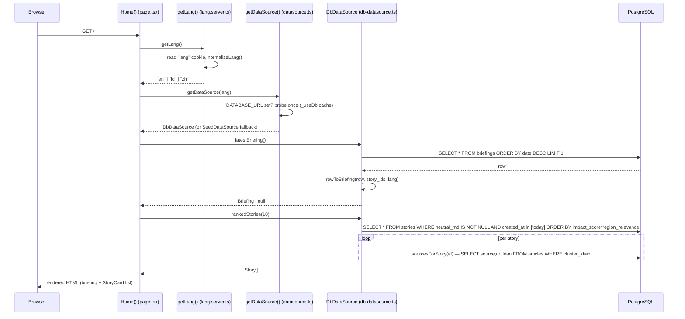
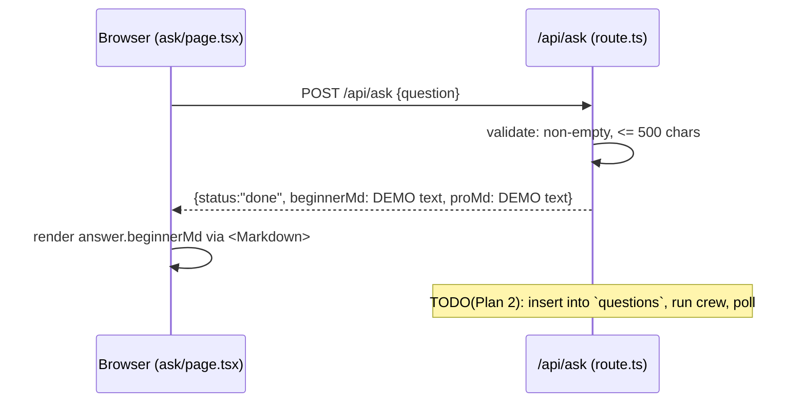

# Request Lifecycle — three user actions, end to end

This page traces **three representative things a user can do**, naming the real
files and functions at every hop. If you can follow these three, you can follow any
flow in the app.

1. **Load the home page** — the common read path.
2. **Click "Update news"** — the trigger-the-engine path (with the secret token).
3. **Ask a question** — the on-demand path (currently a stub; documented honestly).

Throughout, remember the split from `../04-data-flow.md`: the **web app** (Next.js,
port 3000) only *reads* content from PostgreSQL; the **engine** (FastAPI, port 8077)
does all the AI work and all the *writes*.

---

## 1. Load the home page (`/`)

**Goal:** show today's briefing plus the ranked story feed.

**Entry point:** `web/src/app/page.tsx` → `export default async function Home()`.
Because the file declares `export const dynamic = "force-dynamic"`, Next.js renders
it **fresh on every request** (never frozen at build time), so a newly-written
briefing shows up immediately.



### Step-by-step

1. **`getLang()`** (`web/src/lib/lang.server.ts`) reads the `lang` cookie and passes
   it through `normalizeLang` (`web/src/lib/lang.ts`). The result (`en`/`id`/`zh`)
   is threaded into the data source so the right translation columns are picked.

2. **`getDataSource(lang)`** (`web/src/lib/datasource.ts`) decides which data source
   to use:
   - If `process.env.DATABASE_URL` is unset → returns the shared `SeedDataSource`
     (demo content from `web/src/lib/seed.ts`).
   - Otherwise it **probes once** (cached process-wide in the `_useDb` variable):
     it constructs a temporary `DbDataSource`, calls `recentBriefings(1)` /
     `rankedStories(1)`, and if anything comes back it uses the live DB from then
     on. This means the "is the DB usable?" check runs **once per server process**,
     not per request.

3. **`latestBriefing()`** (`web/src/lib/db-datasource.ts`) runs
   `SELECT * FROM briefings ORDER BY date DESC, created_at DESC LIMIT 1`, then
   `rowToBriefing` converts the row into a `Briefing` object. Note: `briefings` has
   a single `summary_md` column, so the converter copies it into **both**
   `beginnerMd` and `proMd` so the beginner/pro toggle never renders blank.

4. **`rankedStories(10)`** computes today's local-day bounds in JS, then runs:
   ```sql
   SELECT * FROM stories
   WHERE neutral_md IS NOT NULL
     AND created_at >= $1 AND created_at < $2
   ORDER BY impact_score * COALESCE(region_relevance, 0) DESC NULLS LAST
   LIMIT $3
   ```
   The ordering is the product **impact × Indonesia-relevance** — a story can have
   low global impact but high local relevance and still rank. For each returned
   story it calls the private `sourcesForStory(id)`, which reads the outlets from
   `articles` (this is an intentional N+1; the count is small).

5. **Rendering.** `page.tsx` renders the briefing block, a `LayerToggle`
   (`web/src/components/LayerToggle.tsx`, a client component that flips between
   beginner/pro markdown), and a `StoryCard` per ranked story.

**To change the home feed ranking or window:** edit `rankedStories` in
`web/src/lib/db-datasource.ts`. **To change what's displayed:** edit
`web/src/app/page.tsx`.

> The same read shape powers the other pages: `/week` →
> `storiesInRange(7)`, `/archive` → `recentBriefings(30)`,
> `/archive/[date]` → `briefingByDate(date)` then `storiesByIds(...)`,
> `/story/[id]` → `storyById(id)`. All live in `db-datasource.ts`.

---

## 2. Click "Update news" (trigger the engine)

**Goal:** make the AI engine fetch fresh news, analyze it, and write new
stories/briefing — then surface them without a manual reload.

**Entry point:** `web/src/components/UpdateButton.tsx` (a `"use client"` component
rendered in `web/src/app/layout.tsx`). It talks **only** to the Next.js API route
`web/src/app/api/refresh/route.ts`, which is the thing that holds the secret token.

```mermaid
sequenceDiagram
    participant B as Browser (UpdateButton)
    participant R as /api/refresh (route.ts)
    participant E as Engine /run-daily (api.py)
    participant Job as _run_daily_job (background)
    participant DB as PostgreSQL
    participant Ext as RSS/GDELT
    participant Oll as Ollama LLMs

    B->>R: POST /api/refresh
    R->>E: POST /run-daily  (header X-Crew-Token)
    E->>E: _check_token(); reject if _job_running (409)
    E->>Job: background_tasks.add_task(_run_daily_job)
    E-->>R: 200 {job_id, "Update started"}
    R-->>B: {status:"started"}
    Note over B: button shows "running", starts 20s polling

    Job->>Ext: run_all() — fetch RSS + GDELT
    Job->>DB: upsert articles, embeddings, clusters
    Job->>Oll: write_story_for_cluster() per top cluster
    Job->>DB: UPDATE stories (neutral/beginner/pro, impact, lean_spread)
    Job->>DB: compose_briefing() → INSERT/UPDATE briefings
    Job->>Oll: _release_gpu() (unload models)

    loop every 20s while running
        B->>R: GET /api/refresh
        R->>E: GET /run-status
        E-->>R: {running: true|false}
        R-->>B: status
        B->>B: router.refresh() (re-render server components)
    end
```

### Step-by-step

1. **Trigger.** `UpdateButton.trigger()` does `fetch("/api/refresh", {method:"POST"})`.
   It never knows the token.

2. **The proxy** `POST` handler in `web/src/app/api/refresh/route.ts` reads
   `CREW_TOKEN` and `ENGINE_URL` from server env, then forwards to
   `${ENGINE}/run-daily` with header `X-Crew-Token: <token>` and an 8-second
   timeout. It normalizes engine responses: `409` → `{status:"running"}`,
   non-OK → `502 {status:"error"}`, network failure → `503 {status:"offline"}`,
   success → `{status:"started", ...}`.

3. **The engine** `run_daily` (`engine/worldnews/api.py`) runs `_check_token`
   (compares `X-Crew-Token` to `CREW_TOKEN`, 401 on mismatch). It refuses if a run
   is already in progress (`_job_running` → 409 — only one GPU-bound run at a time),
   sets the flag, and schedules `_run_daily_job` via FastAPI `BackgroundTasks`.
   It returns **immediately** with a `job_id`; the heavy work runs after the
   response is sent.

4. **The background job** `_run_daily_job`:
   - `run_all()` (`engine/worldnews/pipeline.py`) — fetch RSS
     (`DEFAULT_RSS_FEEDS`) + GDELT (`DEFAULT_GDELT_QUERIES`), `upsert_article`,
     `embed_unembedded`, and `cluster_pending` (semantic clustering at threshold
     `0.82`). A failing feed is logged and skipped, not fatal.
   - Selects up to `TOP_N` (default 12) un-analyzed multi-source clusters
     (`neutral_md IS NULL AND source_count >= 2`).
   - For each, `write_story_for_cluster(conn, cluster_id)`
     (`engine/worldnews/story_writer.py`) fetches full text, loads source
     reputations, runs the 5-agent crew (`analyze_cluster`), reformats the beginner
     and pro layers, recalibrates the impact score, generates an English headline,
     updates source reputation, and `UPDATE`s the `stories` row, then translates it.
   - `compose_briefing(conn, date.today())`
     (`engine/worldnews/briefing_composer.py`) ranks the day's analyzed stories and
     upserts a `briefings` row (`ON CONFLICT (date) DO UPDATE`).
   - `finally:` `_release_gpu()` unloads Ollama models from VRAM and clears
     `_job_running`.

5. **Polling + live refresh.** While `state === "running"`, `UpdateButton` polls
   `GET /api/refresh` every 20 s. That GET proxies to engine `GET /run-status`
   (returns `{running}`), and on each tick the button calls **`router.refresh()`**,
   which re-runs the server components (they are `force-dynamic`) so any
   newly-written stories appear. When `running` flips to false, polling stops.

**To change the trigger/polling UX:** `web/src/components/UpdateButton.tsx`.
**To change proxy behaviour or timeouts:** `web/src/app/api/refresh/route.ts`.
**To change what the job does or how many clusters it analyzes** (`TOP_N`):
`engine/worldnews/api.py`.

---

## 3. Ask a question (`/ask`) — currently a stub

**Goal (intended):** let a reader ask "what is the economic impact of X?" and get a
crew-generated answer. **Reality today:** the answer is hard-coded demo content; no
engine call and no DB write happen. This is documented so you don't assume a live
path that isn't there.



### Step-by-step

1. **`AskPage`** (`web/src/app/ask/page.tsx`, a client component) posts
   `{question: q}` to `/api/ask` and shows a spinner while awaiting.

2. **`POST` handler** (`web/src/app/api/ask/route.ts`) validates the question is
   present and ≤ 500 chars (400 otherwise), then returns a **hard-coded demo
   answer**. The comment `TODO(Plan 2/on-demand): insert into 'questions'
   (status='pending'); poller + crew answer.` marks the unbuilt path.

3. The page renders `answer.beginnerMd` through the `Markdown` component. The pro
   layer is not surfaced on this page.

> **Engine side is also a stub.** `POST /ask` in `engine/worldnews/api.py` is
> guarded by the token and returns `{status:"pending"}` but only logs the question
> — `# TODO: insert into questions table when schema is ready`. The `questions`
> table exists in the schema but no live code reads or writes it.

**To make Ask real, you would touch:** `web/src/app/api/ask/route.ts` (proxy to the
engine instead of returning demo text), `engine/worldnews/api.py` (`/ask` to insert
a `questions` row), a new background poller that runs the crew and fills
`beginner_md`/`pro_md`/`status`, and `web/src/app/ask/page.tsx` (poll for the
answer becoming `done`).
