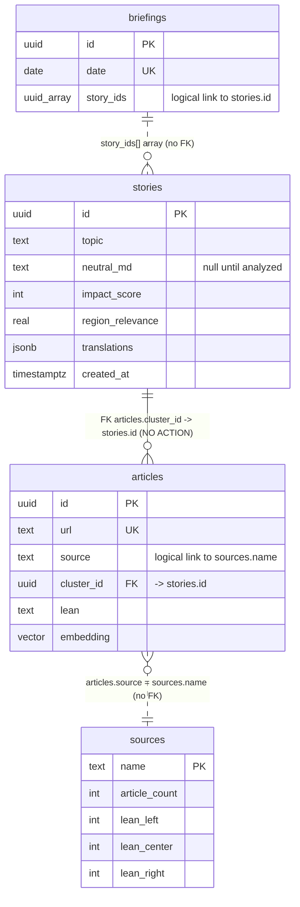

# Database — Relationships

This page explains how the four tables (`stories`, `articles`, `briefings`, `sources`) connect. A key thing to internalize: **only one real SQL foreign key exists**. The other "relationships" are enforced by application code, not by the database, so the database will *not* stop you from creating dangling references.

## Summary of every relationship

| From | To | Cardinality | Enforced by | Mechanism |
|------|----|-------------|-------------|-----------|
| `articles.cluster_id` | `stories.id` | many articles : 1 story (1:N) | **Real FK** | `cluster_id uuid REFERENCES stories(id)` in `0001_init.sql` |
| `briefings.story_ids[]` | `stories.id` | 1 briefing : many stories (1:N) | App code only | `uuid[]` array column; no FK, no join table |
| `articles.source` | `sources.name` | many articles : 1 source (N:1) | App code only | Match on the outlet *name* string; no FK |

There are **no** N:M (many-to-many) join tables in this schema.

## 1. `articles` → `stories` (the only real foreign key)

Each article can belong to at most one story cluster. The link is the `cluster_id` column on `articles`, which is a declared foreign key to `stories(id)`.

- An article with `cluster_id = NULL` is "unclustered" (ingested but not yet grouped).
- Clustering sets it: `assign_cluster` (`engine/worldnews/db.py`, lines 45–55) inserts a `stories` row, then runs `UPDATE articles SET cluster_id = %s WHERE id = ANY(%s)`.
- The web app walks this relationship in the **opposite** direction to build each story's source list: `sourcesForStory` runs `SELECT source, url, lean FROM articles WHERE cluster_id = $1` (`db-datasource.ts`, lines 255–272). The index `idx_articles_cluster` makes this fast.

**Cascade behavior:** The FK is declared **without** an `ON DELETE` clause:

```sql
cluster_id uuid REFERENCES stories(id)
```

In PostgreSQL, omitting `ON DELETE` means `NO ACTION`. Practical effect:

- You **cannot** `DELETE` a `stories` row while any `articles` row still references it — Postgres will raise a foreign-key violation. You must first reassign or delete the child articles (or set their `cluster_id` to `NULL`).
- There is **no** automatic `ON DELETE CASCADE` and **no** `ON DELETE SET NULL`. If you want either behavior you must change the migration (see [migrations.md](./migrations.md)).

## 2. `briefings` → `stories` (array, not a foreign key)

A briefing references the day's stories through the `story_ids uuid[]` array column. This is **not** a foreign key and **not** a join table — it is just an array of uuid values.

- Written by `briefing_composer.py` (lines 100–110), which inserts the chosen story ids into `story_ids`.
- Read by the web app: `rowToBriefing` exposes the array as `storyIds` (`db-datasource.ts`, lines 71–85), and the page layer later calls `storiesByIds(ids)` which runs `SELECT * FROM stories WHERE id = ANY($1)` (lines 181–198).

**Implications you must know:**

- The database does **not** guarantee these ids exist. If a story is deleted, the briefing's `story_ids` array can contain a dangling id. The reader tolerates this gracefully — `storiesByIds` simply returns only the stories that match, so a missing id silently drops out.
- There is no cascade in either direction. Deleting a story does not update any briefing's array; deleting a briefing does nothing to stories.
- Ordering is preserved by the array, which is why the briefing can present its stories in a chosen order.

## 3. `articles` → `sources` (logical, by name)

The outlet reputation table `sources` is keyed by `name` (text PK). Articles record their outlet in `articles.source`. These are linked **only by matching the name string** — there is no foreign key.

- `update_reputation(conn, source, lean, divergence)` (`engine/worldnews/sources_memory.py`) upserts a `sources` row keyed by that name (`INSERT ... ON CONFLICT (name) DO UPDATE ...`).
- Because there is no FK, an `articles.source` value can exist with no matching `sources` row (until reputation is first recorded), and vice versa. Name spelling must be consistent across ingestion for the counts to aggregate correctly — e.g. `Reuters` and `reuters` would be treated as two different outlets.

## Entity-relationship diagram



> In the diagram, solid lines (`||--o{`) are real FKs; dotted lines (`||..o{`, `}o..||`) are logical links enforced only by application code.

## "To change X, touch these files"

- **Make briefing→story a real FK (e.g. a join table):** you would add a new migration creating a `briefing_stories(briefing_id, story_id)` table, update the writer `engine/worldnews/briefing_composer.py`, and update the reader path `web/src/lib/db-datasource.ts` (`rowToBriefing`, `storiesByIds`). This is a bigger change than it looks because the array preserves order; a join table needs an explicit order column.
- **Add `ON DELETE CASCADE` to `articles.cluster_id`:** add a migration that drops and re-adds the constraint (`ALTER TABLE articles DROP CONSTRAINT ...; ALTER TABLE articles ADD CONSTRAINT ... REFERENCES stories(id) ON DELETE CASCADE;`). You must know the existing constraint's auto-generated name first (`articles_cluster_id_fkey` by Postgres convention). Test on a copy — cascading deletes are destructive.
- **Make `sources` a real FK target:** you would need every `articles.source` value to already exist in `sources` (or allow nulls), then add `FOREIGN KEY (source) REFERENCES sources(name)`. Today's ingestion order (articles before reputation) means this would break unless you upsert the source row first. Touch `engine/worldnews/db.py` and `engine/worldnews/sources_memory.py`.
