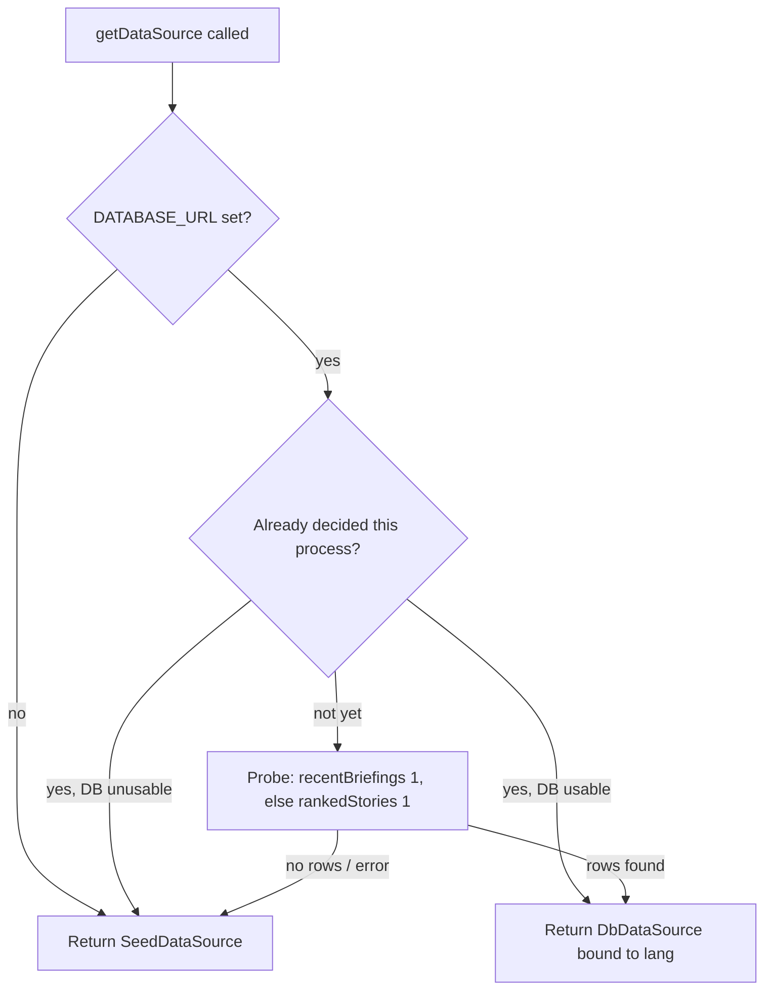

# Database — Seeds & Demo Data

This project does **not** seed the PostgreSQL database with SQL `INSERT`s. Instead, "seed" here means a **hard-coded set of demo stories the Next.js web app falls back to when the real database is empty or unreachable.** Nothing in the seed ever gets written to Postgres — it lives entirely in memory in the web process.

The real data path is the Python engine writing rows (see [tables.md](./tables.md)). The seed is purely a safety net so the frontend never crashes or renders a blank page during development or a database outage.

## Where the seed lives

- **File:** `/home/jiwira/Projects/WorldNews-101/web/src/lib/seed.ts`
- **Class:** `SeedDataSource` (implements the same `DataSource` interface as the live `DbDataSource`, defined in `web/src/lib/datasource.ts`).

Because `SeedDataSource` and `DbDataSource` implement the **same interface**, the rest of the app can use either one without knowing the difference.

## What the seed contains

`seed.ts` defines two in-memory constants:

1. **`STORIES: Story[]`** — seven demo stories, each a fully populated `Story` object (matching the `Story` type in `web/src/lib/types.ts`). Their ids are:
   - `iran-oil-sanctions`
   - `us-china-tariffs-nickel`
   - `fed-rates-bi-response`
   - `palm-oil-eu-deforestation`
   - `rupiah-bi-intervention`
   - `asean-gcc-trade-pact`
   - `coal-china-demand`

   Each story includes a realistic `topic`, a list of `sources` (with per-source `lean`), `leanSpread`, all three analysis layers (`neutralMd`, `beginnerMd`, `proMd`), `sentiment`, `impactScore`, `impactSummary`, `affectedRegions`, and `regionRelevance`. The theme is Indonesia-centric economics, mirroring what the live engine produces.

2. **`BRIEFING: Briefing`** — a single demo daily briefing dated `2026-06-13` (`id: "demo-2026-06-13"`), with a headline, `overallSentiment: "bearish"`, beginner/pro summary markdown, and a `storyIds` array listing all seven demo stories.

## How the fallback decision is made

The selection logic is in `web/src/lib/datasource.ts`, function `getDataSource(lang)`:



Key points:

- If **`DATABASE_URL` is not set**, the app uses the seed and never opens a Postgres connection.
- If it *is* set, the app probes the DB once per process. If the probe finds at least one briefing or story, it uses the live DB; otherwise it falls back to the seed. The decision (`_useDb`) is cached process-wide so the probe runs only once.
- Any error during the probe also falls back to the seed (the `catch` block sets `_useDb = false`).

This means: **an empty-but-running database behaves the same as no database — you see demo content.** To see your own data, the engine must have written at least one analyzed story or one briefing.

## How `SeedDataSource` answers queries

`SeedDataSource` re-implements the read methods over the in-memory arrays (`seed.ts`, lines 422–461):

- `latestBriefing()` / `recentBriefings()` → returns the single demo `BRIEFING`.
- `briefingByDate(date)` → returns `BRIEFING` only if `date === "2026-06-13"`, else `null`.
- `storyById(id)` / `storiesByIds(ids)` → finds matching demo stories by id.
- `rankedStories(limit)` → sorts the seven stories by `impactScore × regionRelevance` descending.
- `storiesInRange(days)` → spreads the demo stories across recent days (2 per day, counting back from `2026-06-13`) so the weekly view has something to group.

## Language note

The seed content is **English only**. The live `DbDataSource` supports per-language `translations`, but `SeedDataSource` ignores language entirely — it always returns the English demo text regardless of the requested `lang`.

## Is any seed data "required to function"?

No row is required for the database itself to work. The seed is *only* required so the **web UI** has something to show when the DB is empty. For a real deployment:

- Required to show real content: at least one `stories` row with `neutral_md` set (analyzed), or one `briefings` row — produced by running the engine pipeline.
- Not required: any manual SQL seeding. There is no SQL seed file and no seed runner for Postgres.

## How to "run" the seed

There is nothing to run. The seed activates automatically whenever the fallback conditions above are met. To **force** seed mode locally, start the web app with `DATABASE_URL` unset:

```bash
cd /home/jiwira/Projects/WorldNews-101/web && npm run dev   # with DATABASE_URL not set in the env
```

To leave seed mode, set `DATABASE_URL` to a Postgres instance that already contains at least one analyzed story or briefing.

## "To change X, touch these files"

- **Edit the demo stories/briefing:** edit `STORIES` / `BRIEFING` in `web/src/lib/seed.ts`. Keep each object matching the `Story` / `Briefing` shapes in `web/src/lib/types.ts`, or TypeScript will fail to compile.
- **Change when the fallback kicks in:** edit `getDataSource` in `web/src/lib/datasource.ts` (the probe and the `_useDb` caching).
- **Add real Postgres seeding (not currently present):** you would add a new `.sql` file under `db/migrations/` with `INSERT` statements, or write a one-off script using `engine/worldnews/db.py`'s `get_conn()`. There is no precedent for this in the repo today — prefer running the real pipeline instead.
