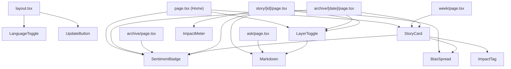

# UI/UX — Component Inventory

Every reusable React component lives in `src/components/`. There are **8 files**, two of
which export two components each (`Impact.tsx`, `BiasSpread.tsx`'s internal `Legend`). This
page documents each: what it renders, its props contract, whether it is server or client,
its dependencies, and where it is used.

> Convention note: most components take an optional `lang?: Lang` prop (default `"en"`) and
> render their text through `t(lang, key)` from `src/lib/ui.ts`. When a parent omits `lang`,
> the component falls back to English — watch for this, because a few call sites (notably the
> home-page briefing badge and the `/archive/[date]` page) forget to pass `lang`, so those
> labels render in English even when the reader picked ID or ZH.

## Where each component is used (at a glance)

---

## Group A — Content display (server components)

### `StoryCard`
- **File:** `src/components/StoryCard.tsx`
- **Type:** Server component (no `"use client"`).
- **Renders:** A clickable story summary row. A big serif rank number (optional), the topic
  as an `h3`, a `SentimentBadge`, a 2-line clamped `impactSummary`, a compact `BiasSpread`
  bar, then a meta line with `ImpactTag`, source count, and up to 3 `affectedRegions` pills.
  The whole card is a `next/link` to `/story/{id}` with a hover state.
- **Props:** `{ story: Story; rank?: number; lang?: Lang }`. `rank` is the position number
  (omit it for an unranked list); `Story` is from `src/lib/types.ts`.
- **Depends on:** `next/link`, `SentimentBadge`, `BiasSpread` (compact), `ImpactTag`, `t()`.
- **Used by:** Home feed (`page.tsx`), `/week`, `/archive/[date]`.

### `SentimentBadge`
- **File:** `src/components/SentimentBadge.tsx`
- **Type:** Server component.
- **Renders:** A small uppercase economic-outlook badge: an arrow (▲ ■ ▼) + a plain-language
  label ("Positive" / "Mixed" / "Negative"), color-coded `bull`/`flat`/`bear`. A `title`
  tooltip adds the finance term + gloss. With `showGloss`, the gloss is shown inline.
- **Props:** `{ sentiment: Sentiment; showGloss?: boolean; lang?: Lang }`. `Sentiment` =
  `"bullish" | "neutral" | "bearish"`.
- **Why it exists:** to translate finance jargon ("bullish") into reader-friendly outlook
  ("Positive — good for growth / your costs") while keeping the term available on hover.
- **Used by:** `StoryCard`, Home briefing header, `/archive` list, `/archive/[date]`,
  `/story/[id]` (with `showGloss`).

### `BiasSpread` (+ internal `Legend`)
- **File:** `src/components/BiasSpread.tsx`
- **Type:** Server component.
- **Renders:** A horizontal stacked bar split into left/center/right segments (widths
  computed from the counts), plus a color-dot legend. **Two modes:** `compact` (thin `h-2`
  bar, short labels — used in cards) and full (taller bar, "How N outlets framed it" kicker,
  long labels, and the AI-assessment disclaimer — used on the story page). `Legend` is a tiny
  private helper rendering a colored dot + label.
- **Props:** `{ spread: LeanSpread; sourceCount: number; compact?: boolean; lang?: Lang }`.
  `LeanSpread` = `{ left: number; center: number; right: number }`.
- **Note:** segment widths are computed as `n / max(total, 1)` so an all-zero spread never
  divides by zero.
- **Used by:** `StoryCard` (compact), `/story/[id]` (full).

### `Impact` — exports `ImpactTag` and `ImpactMeter`
- **File:** `src/components/Impact.tsx`
- **Type:** Server component(s).
- **Shared logic:** a private `tier(score)` function buckets the 0–100 score into three
  tiers — `>=70` high (red `bear`), `>=40` moderate (gold), else low (green `brand`) — and
  returns the matching text color, bar color, and label key.
- **`ImpactTag`** — inline "● Impact NN" tag for cards. Props: `{ score: number; lang?: Lang }`.
- **`ImpactMeter`** — full meter for the story page: a big serif number `NN/100`, a tier
  label, a progress bar whose width is `score%`, and the caption explaining the score.
  Props: `{ score: number; lang?: Lang }`.
- **Used by:** `ImpactTag` in `StoryCard`; `ImpactMeter` in `/story/[id]`.

---

## Group B — Markdown rendering

### `Markdown`
- **File:** `src/components/Markdown.tsx`
- **Type:** Server component.
- **Renders:** A `
` wrapping `<ReactMarkdown>{children}</ReactMarkdown>`.
  This is the single place AI-generated markdown becomes HTML, styled by the `.prose-wn`
  rules in `globals.css`.
- **Props:** `{ children: string }` — the markdown string.
- **Security note (in the file's own comment):** raw HTML is **not** enabled in
  `react-markdown` by default, so model output cannot inject `<script>`. Do **not** add
  `rehype-raw` without sanitization.
- **Used by:** `LayerToggle`, `/story/[id]` (neutral read), `/ask`.

---

## Group C — Interactive client components (`"use client"`)

### `LayerToggle`
- **File:** `src/components/LayerToggle.tsx`
- **Type:** **Client** component (`useState`).
- **Renders:** The "beginner vs pro" reading layers. Shows the beginner markdown by default;
  a toggle button switches to the pro markdown. The button only appears when a distinct pro
  layer exists (`hasLayers` = `proMd` is non-empty and differs from `beginnerMd`). Button
  text flips between "Go deeper — the pro read →" and "← Simpler".
- **Props:** `{ beginnerMd: string; proMd: string; lang?: Lang }`.
- **Depends on:** `Markdown`, `t()`.
- **Used by:** Home briefing, `/story/[id]` ("What this means for you"), `/archive/[date]`.
- **Why client:** the beginner/pro switch is a pure in-page toggle; making it client keeps
  both markdown strings in the initial HTML and toggles without a round-trip.

### `LanguageToggle`
- **File:** `src/components/LanguageToggle.tsx`
- **Type:** **Client** component (`useRouter`).
- **Renders:** The `EN · ID · 中文` switcher in the utility strip. Clicking a language writes
  a `lang` cookie (`max-age` 1 year, `samesite=lax`) and calls `router.refresh()` to
  re-render the server components with the new cookie. The active language is gold and carries
  `aria-current`.
- **Props:** `{ current: Lang }`.
- **Depends on:** `LANGS`/`Lang` from `src/lib/lang.ts`, `next/navigation`.
- **Used by:** `layout.tsx`.

### `UpdateButton`
- **File:** `src/components/UpdateButton.tsx`
- **Type:** **Client** component (`useState`, `useEffect`, `useRouter`).
- **Renders:** The "↻ Update news" trigger in the utility strip. On mount it `GET`s
  `/api/refresh` to reflect a run already in progress. Clicking `POST`s `/api/refresh` to
  start a pipeline run; while running it shows "Updating…" with a spinning glyph, polls
  status every 20s, and calls `router.refresh()` so new stories appear as they land. Status
  notes ("Update started…", "An update is already running.", "Update engine offline.") come
  from `t()`. State machine: `idle → note → running → idle`.
- **Props:** `{ lang: Lang }`.
- **Depends on:** `next/navigation`, `t()`, the `/api/refresh` route (documented in
  `handbook/03-api.md`).
- **Used by:** `layout.tsx`.

---

## Page-local components (not in `src/components/`)

Worth knowing they exist, but they are not reusable:

- **`OutletRow`** — defined inside `src/app/sources/page.tsx`; renders one outlet directory
  row from the static `INDONESIAN_OUTLETS` / `INTERNATIONAL_OUTLETS` arrays.
- **`LEAN_META`** maps in `story/[id]/page.tsx` and a `tier`-style approach in `Impact.tsx`
  are local lookup tables, not components.

## "To change X, touch these files"

| You want to change… | Touch |
|---------------------|-------|
| The story summary row layout | `src/components/StoryCard.tsx` |
| Sentiment labels / colors / arrows | `src/components/SentimentBadge.tsx` + sentiment tokens in `globals.css` + `ui.ts` keys |
| The bias bar appearance | `src/components/BiasSpread.tsx` + `lean-*` tokens |
| Impact tiers / thresholds (70 / 40) | the `tier()` function in `src/components/Impact.tsx` |
| How AI markdown is rendered/sanitized | `src/components/Markdown.tsx` + `.prose-wn` in `globals.css` |
| Beginner/pro toggle behavior | `src/components/LayerToggle.tsx` |
| Language switching | `src/components/LanguageToggle.tsx` + `src/lib/lang.ts` / `lang.server.ts` |
| The update-trigger UX/polling | `src/components/UpdateButton.tsx` + `src/app/api/refresh/route.ts` |
