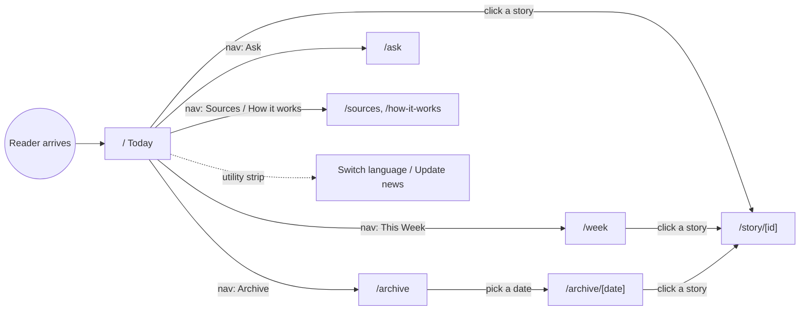

# UI/UX — User Journeys

This page walks the **main reader journeys** screen by screen, tying each screen to its
route, the server data it loads, and the components it renders. Use it to understand the
reader's path before changing navigation or page structure.

The reader is, by design, an **Indonesian non-expert** who wants to understand world news
through an economic lens. Every journey starts from the shared shell in
`src/app/layout.tsx` (utility strip → masthead → sticky nav → content → footer), so the
reader can always jump between sections via the 6-link nav: **Today, This Week, Archive,
Ask, Sources, How it works.**

## Journey overview

---

## Journey 1 — "What's happening today?" (the primary path)

**Route:** `/` → `src/app/page.tsx` (server, `force-dynamic`).

**What loads:** `getDataSource(lang)` then `ds.latestBriefing()` and `ds.rankedStories(10)`.

**The screen, top to bottom:**
1. **Today's Briefing** section — a kicker + a `<time>` date + a `SentimentBadge` for the
   overall outlook, a large serif headline, and the briefing body inside a `LayerToggle`
   (beginner by default, "Go deeper" reveals the pro layer). If there is no briefing yet, an
   empty state explains the pipeline runs each morning.
2. **Today's stories** section — a `border-b-2` heading with a "Ranked by impact ×
   Indonesia relevance" kicker, then the ranked feed of `StoryCard`s (each numbered 1..N).

**Reader action:** click any `StoryCard` → Journey 4 (story detail).

> Note: the briefing's `SentimentBadge` is rendered without a `lang` prop here, so its label
> shows in English even when the reader chose ID/ZH. The story cards below it *do* receive
> `lang`.

---

## Journey 2 — "What happened this week?"

**Route:** `/week` → `src/app/week/page.tsx` (server, `force-dynamic`).

**What loads:** `storiesInRange(7)` — analyzed stories from the last 7 days, each carrying a
published `date`.

**The screen:** a header (kicker + title + intro), then stories **grouped by published day**
(newest day first). Each day is a section with a `border-b-2` day heading
("Tuesday, 10 June"), a story count, and ranked `StoryCard`s within that day. Empty state if
nothing was analyzed in 7 days.

**Reader action:** click a `StoryCard` → story detail.

---

## Journey 3 — "Show me past briefings" (archive)

**Two screens.**

### 3a. Archive list — `/archive` (`src/app/archive/page.tsx`, server, `force-dynamic`)
Loads `recentBriefings(30)`. Renders a header then a list: each row is a `next/link` to
`/archive/{date}` showing the formatted date, the headline, and a `SentimentBadge`. Empty
state if there are none.

### 3b. One past briefing — `/archive/[date]` (`src/app/archive/[date]/page.tsx`, server)
Loads `briefingByDate(date)` (→ `notFound()` if missing) and then
`storiesByIds(briefing.storyIds)`. Renders a "← Back to archive" link, the date +
`SentimentBadge`, the headline, the briefing body in a `LayerToggle`, and a "Stories from
this briefing" grid of `StoryCard`s.

> This page uses the **old slate/blue styling** (`text-slate-900`, `text-blue-600`, inline
> Georgia) and does **not** call `getLang()`/pass `lang`, so it renders English regardless of
> the chosen language. See `handbook/06-ui-ux.md` honest-status notes. Migrating it to the
> editorial tokens + `lang` would align it with `/` and `/week`.

---

## Journey 4 — "Explain this one story" (the core value screen)

**Route:** `/story/[id]` → `src/app/story/[id]/page.tsx` (server).

**What loads:** `storyById(id)` (→ `notFound()` if missing).

**The screen is ordered to mirror how a non-expert reads news:**
1. **Header** — "Story" kicker, the topic as `h1`, and a one-line `impactSummary`.
2. **At a glance** card — two plainly-labelled metrics: **Economic outlook**
   (`SentimentBadge` with `showGloss`) and **How big a deal** (`ImpactMeter`, the 0–100
   number + bar + caption). Then **Affects** region pills.
3. **The neutral read** — a neutral summary of *what happened* (`Markdown`), shown first so
   the reader has the facts before the interpretation.
4. **What this means for you** — the centerpiece, in a gold-left-bordered card: the
   beginner/pro economic analysis via `LayerToggle`.
5. **Media bias spread** — the full `BiasSpread` bar + legend + AI-assessment disclaimer.
6. **Original sources** — a 2-column grid of outlet links (new tab), each with the outlet's
   first-letter avatar and its AI-rated lean label, plus a disclaimer.

This page is the most complete use of the design system and is the model the other pages
should follow.

---

## Journey 5 — "Ask my own question"

**Route:** `/ask` → `src/app/ask/page.tsx` (**client** component).

**The screen:** a heading, a single text input (max 500 chars), and an "Analyze" button.
On submit it `POST`s `/api/ask`; while waiting it shows "🤖 Agents are analyzing…"; the
answer renders the beginner markdown in a card. Errors render in red.

> Honest status: this is a **demo**. `POST /api/ask` returns hard-coded placeholder markdown
> (see `handbook/03-api.md`) — no engine, no DB. The page is also **English-only** and uses
> the **old slate/blue styling**, and it discards the `proMd` it receives (only `beginnerMd`
> is shown). Treat it as a stub UI awaiting the on-demand Q&A backend.

---

## Journey 6 — "Why should I trust this?" (transparency pages)

- **`/sources`** (`src/app/sources/page.tsx`, static) — methodology explainer (5-step
  ingestion → clustering → bias → analysis → impact pipeline) plus directories of Indonesian
  outlets, international outlets, and supplementary data sources, ending in an amber caveats
  box (bias is an AI estimate, not financial advice, local hardware only).
- **`/how-it-works`** (`src/app/how-it-works/page.tsx`, static) — short explainer of the five
  agents (Curator, Bias Analyst, Game-Theory Analyst, Markets Analyst, Editor) with a link to
  the author's case study.

Both are static, English-only, and use the old slate/blue styling.

---

## Cross-cutting journey — language & freshness (always available)

From the **utility strip** in `layout.tsx`, on every screen:

- **Switch language** (`LanguageToggle`) — sets the `lang` cookie and refreshes; server
  pages re-read it via `getLang()` and re-render content + UI chrome in EN/ID/ZH.
- **Update news** (`UpdateButton`) — triggers a pipeline run via `/api/refresh`, then polls
  and auto-refreshes the page so freshly-analyzed stories appear without a manual reload.

## To change a journey, touch these files

| Change | Files |
|--------|-------|
| Add a new top-level screen | new `src/app/<route>/page.tsx` + add to `NAV` in `layout.tsx` |
| Reorder the story page sections | `src/app/story/[id]/page.tsx` |
| Change what the home feed ranks/shows | `src/app/page.tsx` + `rankedStories()` in the data-source layer |
| Change the weekly grouping window | `storiesInRange(7)` call in `src/app/week/page.tsx` |
| Wire the Ask page to a real backend | `src/app/ask/page.tsx` + `src/app/api/ask/route.ts` (see `handbook/03-api.md`) |
| Global nav / chrome | `src/app/layout.tsx` |
